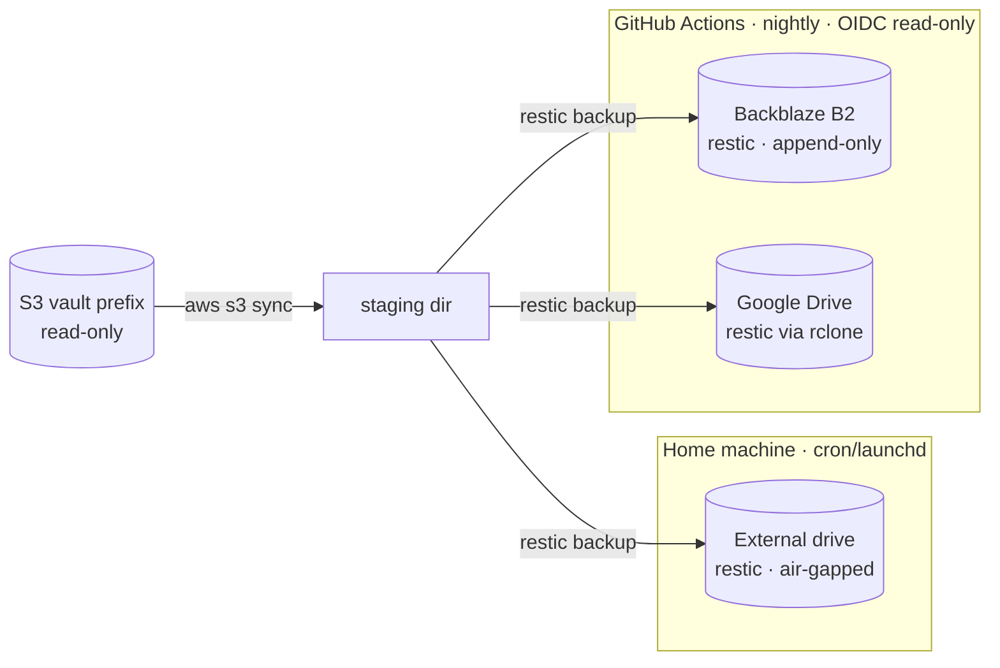

# Vault Backup — Design & Runbook

How to make **real backups** of the vault, kept on an **external hard drive** (offline / air-gapped)
and on **network storage** (Backblaze B2, Google Drive). This is the "why + what + how"; the runnable
pieces are `scripts/backup/*` and `templates/s3-backup.yml`.

For the sync system this protects, see [IMPLEMENTATION.md](IMPLEMENTATION.md) (bucket layout §2.1,
security §10). This document does not duplicate it — it references it.

> [!summary] One paragraph
> The vault already lives in three places — the **S3 hub**, the **GitHub repo**, and every **device** —
> but all three are one live-synced **failure domain**: a bad merge, a mass delete, a leaked plugin
> key, or an AWS-account compromise propagates to all of them, so **none is a backup**. A backup must
> be **decoupled** (pull-only; the sync system's credentials can't reach it), **point-in-time**
> (restore to *before* the damage, not just "latest"), **off-account / off-provider**, at least one
> copy **offline**, and **verified**. We do this with **restic**: a nightly read-only pull of the S3
> prefix, snapshotted into **three independent, encrypted restic repositories** — an external drive
> (air-gapped, at home), **B2**, and **Google Drive**. The cloud repos are filled unattended from
> **GitHub Actions** (OIDC → a *read-only* IAM role); the drive is filled by a local cron/launchd run.

---

# 1. Why the existing copies are not backups

| "Copy" that exists today | Why it is **not** a backup |
|---|---|
| S3 bucket (the hub) | Holds only **current** state. A propagated delete/corruption overwrites it; anyone with the plugin key (on every device, and inside every starter zip — IMPLEMENTATION.md §4.10, §10) can delete objects *and* their versions. |
| GitHub content repo | Live-synced too. `git-sync` commits whatever S3 says — including a mass tombstone. History can be rewritten/deleted on account compromise. |
| Other devices | Live-synced. The mass-missing guard (§4.4) reduces accidental wipes but is a heuristic, not a guarantee, and it does not protect against *content* corruption. |

All three move **in lockstep by design** (IMPLEMENTATION.md §6). That is exactly what you want for
*availability* and exactly what disqualifies them as *recovery* copies. The failure modes a backup
must survive are the ones that ride the sync:

- **Logical corruption** — a buggy plugin build or a pathological union-merge writes garbage into a
  note; it hashes as a normal change and propagates everywhere.
- **Mass deletion** — an errant `Resync everything`, a device restored from a stale image, a script,
  or a malicious client emits tombstones that delete the vault on every leg.
- **Credential / account compromise** — the plugin's IAM key is long-lived and copied to every device
  and every starter zip (§10). A leaked key can `DeleteObject` + `DeleteObjectVersion` across the
  prefix. An AWS-account or GitHub-account takeover can erase the bucket or the repo outright.
- **Provider / region loss** — account closure, billing lockout, regional outage.

# 2. Requirements (3-2-1-1-0)

The classic rule, mapped to this vault:

| Rule | Requirement | How we meet it |
|---|---|---|
| **3** copies | ≥3 copies of the data | The live vault + **3 backup repos** (drive, B2, Drive). |
| **2** media / providers | on ≥2 distinct technologies/providers | Local disk + Backblaze + Google — none is AWS. |
| **1** offsite | ≥1 geographically/administratively separate | B2 and Google Drive are both off-AWS-account. |
| **1** offline / immutable | ≥1 copy air-gapped or write-once | The **external drive** (offline between runs) **and** an **append-only** B2 key (§6.3). |
| **0** errors | verified restorable | `restic check` + scheduled **test restore** + snapshot-age alarm (§7). |

Derived, non-negotiable properties:

- **Pull-only.** The backup pulls *from* S3 with a **read-only** identity (Get/List, no Put/Delete —
  strictly less than the sync role). The backup destinations are never written by the sync system and
  hold credentials the sync system never sees. Damage cannot flow *into* a backup.
- **Point-in-time history.** Each run is an immutable **snapshot**; you can restore last night, last
  week, or last month — the copy from *before* a corruption. Latest-only mirroring would just mirror
  the corruption.
- **Encrypted off-site.** B2 and Google are third parties; the repo is client-side **AES-256**
  encrypted, so they store only opaque packs. (S3 itself is only SSE-S3 / provider-managed —
  IMPLEMENTATION.md §10 — which does not protect against the provider or a bucket-read leak.)

# 3. What is backed up

The source is the vault's S3 prefix (IMPLEMENTATION.md §2.1):

```
s3://<bucket>/<prefix>/
  snapshot.json.gz            ← folded protocol state  (tiny)
  deltas/<pad10(rev)>.json.gz ← journal                (tiny)
  files/<vault-path>          ← the actual note bytes   ← THE PAYLOAD
  _logs/<deviceId>.log        ← diagnostics             ← EXCLUDED
```

- **`files/**` is the whole point.** Those objects are the note contents, keyed by vault path,
  human-readable with **no tooling** — a restored `files/` tree opens directly as an Obsidian vault or
  reads as plain text. This is what a panic restore needs.
- **`snapshot.json.gz` + `deltas/`** are kept too (they are tiny) so a restore can *also* reconstitute
  the live hub and resume sync from the exact revision, rather than reseeding from scratch (§8.2).
- **`_logs/` is excluded** — it is a diagnostic side-channel (IMPLEMENTATION.md §2.1, §4.11), carries
  note paths, and has no recovery value.

> [!note] S3 object *versions* are deliberately **not** part of the backup
> The bucket keeps noncurrent versions only as **merge bases** for *live* conflict resolution
> (IMPLEMENTATION.md §2.1, §8; a lifecycle rule expires them ~90 days). Restore does not need them:
> you recover **current** content and let sync rebuild its own bases. The backup's *own* snapshots are
> the point-in-time history that matters — and they reach back far further than 90 days (§5).

# 4. Topology — two runners, three repos, one script

An external USB drive is unreachable from the cloud, so the work splits across two runners that share
**one implementation** (`scripts/backup/backup.sh`) pointed at different destinations — the same
"one protocol, two legs" shape the sync system uses.



1. **Cloud leg — `templates/s3-backup.yml`** (unattended). A scheduled workflow assumes a **read-only**
   IAM role via OIDC (§6.2), pulls the prefix to the runner, and runs `restic backup` to **B2** and
   **Google Drive**. Restic password + B2/Drive keys live only in **GitHub Actions secrets** — never in
   AWS, never on a device — so an AWS-account compromise cannot reach the backups. The B2 key is
   **append-only** (§6.3), so a compromised *runner* can add snapshots but cannot erase history.
2. **Local leg — `scripts/backup/backup.sh`** (attended-ish). A cron/launchd job on a home machine
   pulls the prefix and runs `restic backup` to the **external drive** when it is mounted (no-ops
   cleanly when it is not). Because this machine is **trusted**, it also owns **pruning** and the
   heavier `restic check` (the cloud leg can't prune — its key can't delete).

**Each destination is an independent restic repository** filled directly from the source — not copies
of one repo. Corruption, ransomware, or a bad prune on one repo cannot propagate to the others, and
any one surviving repo is a complete restore point.

# 5. Engine: restic (and why)

| Need | restic gives |
|---|---|
| Point-in-time recovery | Immutable **snapshots** per run; restore any past one. |
| Cheap history for 20k small notes | **Dedup + compression** — months of daily snapshots cost a fraction of one full copy. |
| Safe on B2 / Google Drive | Built-in **AES-256 authenticated** client-side encryption. |
| One tool, three destinations | Native **local**, **B2**, and **rclone** (→ Google Drive) backends, identical snapshots. |
| Catch silent rot | `restic check` / `--read-data`; every pack is MAC'd. |
| Bounded storage | `forget --keep-* --prune` retention. |
| Immutable cloud copy | **append-only** repo mode for the unattended key. |

> [!note] Lighter alternative
> If you would rather have a **plain browsable mirror**, `rclone sync s3:… drive: --backup-dir
> dated/` gives dated change-folders with no dedup and no encryption (add `rclone crypt` for the
> latter). It is simpler but a weaker point-in-time story and larger. This design standardizes on
> **restic**; the scripts are restic. Use rclone only if you specifically want the browsable copy.

Retention default (`scripts/backup/backup.sh`, tune per taste):

```
--keep-daily 14 --keep-weekly 8 --keep-monthly 12 --keep-yearly 3
```

# 6. Provisioning (one-time)

## 6.1 The restic password — the master secret

restic encrypts every repo with a password. **Lose it and every backup is unrecoverable** — treat it
like the root of trust:

- Store it in your password manager **and** offline (printed, in a safe / with the drive).
- **Do not** keep it *inside the vault* (don't back up the key inside the thing it protects).
- Use the **same** password for all three repos so any one restores with one secret, or distinct
  passwords if you prefer blast-time isolation — your call. The scripts read
  `RESTIC_PASSWORD_FILE`.

## 6.2 Read-only AWS access for the cloud leg (OIDC)

A **separate, least-privilege** identity from the sync plugin/role — Get/List only:

```json
{
  "Version": "2012-10-17",
  "Statement": [
    { "Effect": "Allow",
      "Action": ["s3:GetObject", "s3:GetObjectVersion"],
      "Resource": "arn:aws:s3:::YOUR-VAULT-BUCKET/<prefix>*" },
    { "Effect": "Allow", "Action": ["s3:ListBucket"],
      "Resource": "arn:aws:s3:::YOUR-VAULT-BUCKET",
      "Condition": { "StringLike": { "s3:prefix": ["<prefix>*"] } } }
  ]
}
```

Attach it to a role trusted by the **backup workflow's** repo, exactly like the sync role but with the
policy above (SETUP.md §3 shows the OIDC provider + trust-policy shape — reuse the provider, add this
role). For a **local** leg, mint a dedicated IAM user with the *same* read-only policy and one access
key; the plugin's key must never be reused for backups.

## 6.3 Backblaze B2 (append-only for the unattended leg)

- Create a private B2 bucket (e.g. `yourname-vault-backup`).
- Create **two** application keys scoped to that bucket:
  - **append-only** (`listBuckets, listFiles, readFiles, writeFiles` — **no** `deleteFiles`) → this is
    the key in **GitHub secrets**. It can add snapshots but never erase history, so a compromised
    runner (or a bug) cannot destroy the backup. It also means the cloud leg **cannot prune** (§7).
  - **full** (adds `deleteFiles`) → kept only on the **trusted local machine**, used for the periodic
    `forget --prune` maintenance run.

## 6.4 Google Drive (via rclone)

Configure an rclone remote named `gdrive` pointing at a **dedicated backup folder** (ideally its own
Google account or a Shared Drive; a service account avoids interactive-token expiry). For CI, store the
whole `rclone.conf` as a base64 GitHub secret and materialize it at run time (the workflow does this).
restic addresses it as `rclone:gdrive:vault-restic`.

## 6.5 The external drive

Format it (any FS restic can write). The repo lives at e.g. `/Volumes/Backup/vault-restic`
(macOS) or `/mnt/backup/vault-restic` (Linux). Keep it **unplugged** between runs — that offline gap
*is* the air-gap. Keep a copy of the restic password with the drive but **not on the same partition**
in plaintext.

# 7. Verification & monitoring — the "0"

A backup you have never restored is a hypothesis. The scripts bake verification in:

- **Structure check** — `restic check` weekly (both legs).
- **Data check** — `restic check --read-data-subset=5%` monthly, on the **trusted local** leg (reads
  real pack bytes; catches bit-rot the structure check misses).
- **Test restore** — the workflow periodically restores the **latest** snapshot to a temp dir and
  asserts a sentinel file and a nonzero `files/` count; a failure fails the run loudly.
- **Staleness alarm** — after each run, `MAX_AGE_HOURS` guards the newest snapshot's age; if backups
  silently stopped, the next run (and GitHub's failure notification / a cron mail) screams.
- **Pruning is trusted-only.** The cloud leg's append-only key **cannot** prune; the local leg runs
  `forget --prune`. This is intentional: the immutable cloud history is the ransomware backstop.

# 8. Restore

Two modes — pick by what broke.

## 8.1 Panic read ("I just need my notes")

The tool is gone / the account is locked / you just want a file back:

```bash
scripts/backup/restore.sh --repo <drive|b2|gdrive> --list          # pick a snapshot (a point in time)
scripts/backup/restore.sh --repo <drive> --snapshot <id> --target ./restored
# → ./restored/files/** is your vault, plain files. Open it in Obsidian, or read the note directly.
```

No S3, no AWS, no plugin required. `files/` *is* the vault.

## 8.2 Rebuild the live hub (resume sync)

To bring the whole system back after a bucket loss/corruption:

1. **Pause sync on every device first** (Settings → *Pause sync*, or the `Pause/resume sync` command —
   IMPLEMENTATION.md §4.9) so live edits don't race a half-restored bucket.
2. Restore a chosen snapshot to a staging dir (as above).
3. Push it into a fresh (or the same) prefix:
   ```bash
   aws s3 sync ./restored "s3://<bucket>/<prefix>" --delete   # needs a WRITE identity, not the backup one
   ```
4. Let `git-sync` run and the devices resume. Content is hash-addressed and merges are unions
   (IMPLEMENTATION.md §2.6), so re-seeded state reconciles without data loss; where a device still
   holds newer local edits they **union-merge** rather than clobber.

> [!tip] Restoring an *earlier* point-in-time on purpose (undo a corruption)
> Pick the snapshot from **before** the bad change, restore, then push with `--delete`. Because you
> paused devices, the older-but-correct state becomes the new hub truth; on resume, any genuinely newer
> device edits union-merge back in.

# 9. Failure & recovery

| Failure | The backup's answer |
|---|---|
| Note corrupted by a bad merge/build, propagated everywhere | Restore that note (or the vault) from a snapshot dated **before** the corruption (§8). |
| Mass tombstone wiped the vault on all legs | Restore latest good snapshot; rebuild the hub (§8.2). |
| Leaked plugin key deletes objects **and** versions | Backups are on a different account with a **read-only** puller; restore intact. |
| AWS account compromised / bucket deleted | B2 + Drive repos are off-AWS; restic password isn't in AWS. Restore, reseed a new bucket. |
| GitHub account compromised | Backups don't depend on the repo; the drive leg doesn't even touch GitHub. |
| Ransomware encrypts the runner / a device | Append-only B2 key can't be used to delete history; the drive is offline. Restore from either. |
| Silent bit-rot in a backup repo | `restic check --read-data` detects it; the **other two** repos are intact. |
| Backups silently stopped | Snapshot-age alarm (§7) + failed-run notification. |
| **Lost the restic password** | Unrecoverable by design — this is why §6.1 mandates an offline copy. |

# 10. Constants & defaults

| Constant | Default | Where |
|---|---|---|
| Cloud backup schedule | daily `17 3 * * *` (UTC) | `templates/s3-backup.yml` cron |
| Retention | daily 14 / weekly 8 / monthly 12 / yearly 3 | `backup.sh` `KEEP_*` |
| Snapshot-age alarm | 36 h | `backup.sh` `MAX_AGE_HOURS` |
| Structure check | weekly | both legs |
| Data check (`--read-data-subset`) | 5% monthly | local leg |
| Excluded from source | `_logs/**` | `backup.sh` `aws s3 sync --exclude` |
| Pruning | trusted local leg only | append-only cloud key (§6.3) |

---

See `scripts/backup/README.md` for the exact commands, `scripts/backup/backup.sh` /
`restore.sh` for the implementation, and `templates/s3-backup.yml` for the unattended cloud leg.
