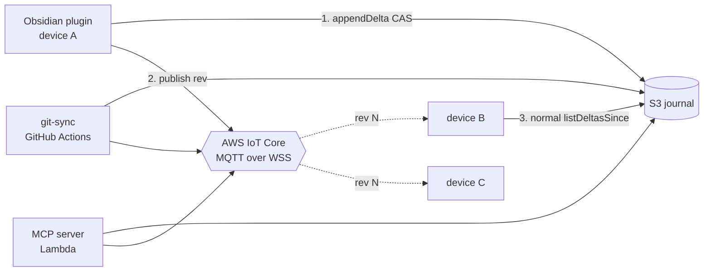

# Change Notification Design

How a device learns that the journal advanced. **Both tiers are now implemented** — Tier 0
(**adaptive polling**) as IMPLEMENTATION.md §4.9a, Tier 1 (**publisher-announce push**) as §4.14.
This document is the rationale, cost model and rejected alternatives; §4.14 is what the code does.

> [!summary] One paragraph
> Every writer already knows the revision it just appended, so nothing needs to watch S3. After a
> successful `appendDelta`, a writer publishes a ~40-byte MQTT message — `{rev, by}` — to one AWS IoT
> Core topic; subscribers see it in milliseconds and run the **same** `listDeltasSince` cycle a poll
> would have run. The notification carries no content, establishes no state, and changes no schema:
> it is a **hint that a poll is worth doing now**. Polling stays as the safety net, slowed to 60 s.
> A dropped message costs latency, never correctness.

---

# 1. The problem, and what Tier 0 already fixed

The plugin polled S3 on a fixed `pollIntervalSec` (default 15 s): one `LIST` per tick per device,
forever, whether or not anyone was looking at the device. Two costs:

- **Latency.** Up to a full interval before a change made on one device appears on another — most
  noticeable in the exact moment you pick up the other device.
- **Waste.** ~175k LISTs/device/month ≈ **$0.88/device/month**, the overwhelming majority against a
  vault that had not changed.

**Tier 0 (implemented, §4.9a)** made the interval adaptive — ACTIVE 5 s / baseline 15 s /
BACKGROUND ≥60 s — and syncs immediately on return to a device. That covers the common case (you
come back to a laptop and it is already current) and *reduces* total requests, because devices are
idle or hidden most of the day. What it cannot do is deliver a change to a device you are **already
looking at** in less than the baseline interval. That is Tier 1's job.

---

# 2. Tier 1 — publisher-announce over AWS IoT Core

## 2.1 Shape



The publisher announces; subscribers pull as they always have. **No S3 event notifications, no
Lambda hop, no fan-out infrastructure** — the writers are all ours and all already know the rev.

## 2.2 Topic and payload

```
Topic:    vaultsync/<prefix-slug>/rev          (one per vault, matching the S3 <prefix>)
Payload:  {"rev": 4213, "by": "macmini-8f3a"}  QoS 0, retain off
```

- `by` lets a subscriber drop its **own** announcement without a round trip — the same echo
  suppression the journal already does with `Delta.by` (§2.4).
- `rev` lets a subscriber skip a cycle it is already past (`rev <= lastSyncedRev` → ignore).
- **No content, no paths, no hashes.** The payload is one integer and a device label, so the topic
  leaks strictly less than the bucket it points at (§5).
- QoS 0 and no retain are deliberate: a message that arrives late or not at all must be worthless,
  because the poll will cover it. Retained messages would hand a reconnecting client a stale rev to
  react to, which is noise, not safety.

## 2.3 Client side (plugin)

- **Connect.** Presign a WebSocket URL for `GET /mqtt` on the account's IoT **ATS data endpoint**
  with SigV4 — `aws4fetch` (already a dependency, v1.0.20) supports `signQuery: true`, so this reuses
  the credentials and signing path already in `s3-fetch-adapter.ts`. Presigned URLs expire in ≤5 min,
  but an **established** SigV4 connection lives up to 24 h; reconnects simply re-presign.
- **Client id** = `deviceId` (§4.2). IoT disconnects an existing client with the same id, so the
  per-device uniqueness the sync protocol already guarantees is exactly what this needs.
- **MQTT.** Only QoS 0 is required: `CONNECT`/`CONNACK`, `SUBSCRIBE`/`SUBACK`, `PUBLISH`,
  `PINGREQ`/`PINGRESP`. That is ~200 lines of packet encoding — worth hand-rolling rather than
  taking `mqtt.js` (~150 KB) into a bundle that ships to phones, and in the same spirit as the
  hand-parsed `ListObjectsV2` XML already in the adapter. Keep-alive 60 s (IoT does not bill pings).
- **On message** → `runSync("notified")`, which coalesces into the engine's single-flight queue like
  any other trigger. No new cycle type, no new engine API.
- **Lifecycle.** Connect when polling starts; disconnect on `visibilitychange → hidden` (mobile is
  about to be suspended and the socket dies anyway) and reconnect on return, alongside the existing
  Tier 0 focus/resume handling. Exponential backoff on failure, capped — and **never block or fail a
  sync cycle because the socket is down**.
- **Setting.** `pushNotifications: boolean` (default off until proven in the field) plus
  `iotEndpoint: string`. Both per-device in `data.json` like every other connection field (§7.1).

## 2.4 Publisher side

Every writer publishes immediately after its CAS append succeeds — never before (the journal must be
readable when a subscriber reacts):

| Writer | How |
|---|---|
| Plugin | same MQTT connection it already holds for subscribing |
| git-sync | one `iot-data:Publish` HTTPS call via the AWS SDK, after the delta append (§5.5). Its OIDC role gains the one action |
| MCP server | same, after its `by: "mcp"` append |

A writer that cannot publish **logs and continues**. Announcement is never on the correctness path.

## 2.5 Poll interaction

With Tier 1 on, the Tier 0 baseline relaxes to **60 s** (ACTIVE tier still applies, since a burst of
local edits is about pushing, not listening). Effect per device: ~43k LISTs/month ≈ **$0.22/month**,
down from $0.88, *with* sub-second convergence instead of up-to-15 s.

---

# 3. Cost

| Item | Rate | Per device / month |
|---|---|---|
| IoT connection | $0.08 / 1M connection-minutes | 43,200 min → **$0.0035** |
| IoT messages | $1 / 1M messages (5 KB units; pings free) | ~3k msgs → **$0.003** |
| S3 LIST at 60 s baseline | $0.005 / 1,000 | 43,200 → **$0.22** |
| **Tier 1 total** | | **≈ $0.23** |
| *Current 15 s fixed poll, for comparison* | | *$0.88* |

Absolute numbers are small at three devices; the point is that push is both **faster and cheaper**,
so there is no latency-vs-cost trade to argue about.

---

# 4. Alternatives considered

| Option | Verdict |
|---|---|
| **SQS long-poll + SNS fan-out** | Works with the existing signed-HTTP adapter and needs no WebSocket at all — but every device needs its own queue, created, subscribed and garbage-collected when a device disappears. Real ops for the same result. **Best fallback if a network blocks IoT.** |
| **AppSync Events** | Plain WS + JSON, no library, IAM auth — but the IAM-over-WebSocket handshake (base64 auth in the subprotocol header) is fiddly, and it is another service to bootstrap for no gain over IoT. |
| **API Gateway WebSocket + Lambda + DynamoDB** | A real server with a connection table. Most moving parts of any option; nothing here needs server-side logic. |
| **Lambda Function URL long-poll** (reuse MCP infra) | Simplest to reason about, but bills held wall-clock time and burns a concurrent execution per connected device. Wasteful for a wake-up signal. |
| **S3 Event Notifications → EventBridge** | Not a client transport on its own — it still needs one of the above to reach a device. Worth adding **only** if a writer might not announce; all three writers are ours, so it is redundant today. |
| **Third-party (Ably / Pusher / Momento)** | Another vendor and another credential in `data.json`, for a signal we can carry on infrastructure we already pay AWS for. |

---

# 5. Security & privacy

- **IAM (plugin user):** `iot:Connect` on `client/<deviceId>`, `iot:Subscribe`/`iot:Receive` on the
  single vault topic, `iot:Publish` on the same. Scoped like the existing bucket policy (§10) —
  it grants no access to vault content.
- **What the topic exposes:** a revision number and a device label. Anyone able to subscribe learns
  *that* the vault changed and *which device* changed it, never *what* changed. That is strictly less
  than the bucket read access the same credentials already carry.
- **Transport:** WSS/TLS to the ATS endpoint on 443, SigV4-authenticated per connection.
- **Blast radius unchanged:** the credential set is the same IAM user; no new long-lived secret.

---

# 6. Failure modes

| Failure | Behaviour |
|---|---|
| Socket never connects (firewall, bad endpoint, expired presign) | Log once, retry with capped backoff. **Polling continues** — the device is exactly as current as it is today |
| Message lost / QoS 0 drop | Next poll catches it. Latency, not loss |
| Duplicate / out-of-order messages | `rev <= lastSyncedRev` → ignored; the engine coalesces concurrent triggers anyway |
| Spoofed or replayed announcement | Worst case a spurious `listDeltasSince` — the message is never trusted as data, only as a nudge. Publishing requires the same IAM credentials that already grant bucket writes |
| Device suspended with the socket open | Broker drops it on keep-alive; the return-to-device path reconnects and syncs (§4.9a) |
| IoT Core outage | Degrades to Tier 0 polling |

The invariant behind every row: **the notification is a hint, never a source of truth.** Nothing in
the protocol, the schemas, or the merge changes — which is what makes this safe to add to a system
whose expensive bugs have all been correctness bugs.

---

# 7. Implementation checklist (done)

1. ✅ `scripts/install/06-enable-push-notifications.sh` — resolve the ATS endpoint (`aws iot describe-endpoint --endpoint-type
   iot:Data-ATS`), extend the plugin IAM user's policy and the git-sync OIDC role with the four
   `iot:*` actions, scoped to the vault topic; record the endpoint in SETUP.md.
2. ✅ `packages/obsidian-plugin/src/mqtt.ts` — minimal QoS-0 MQTT-over-WSS client (packet codec +
   connect/subscribe/publish/ping), unit-tested against captured packet fixtures.
3. ✅ `packages/obsidian-plugin/src/notify.ts` — presign, connect, backoff, lifecycle; `onRev` callback
   into `runSync("notified")`.
4. ✅ `main.ts` — wire lifecycle to the existing poll/focus/visibility handling; add the two settings;
   relax the baseline to 60 s when notifications are connected.
5. ✅ `packages/git-sync` + `packages/mcp-server` — publish after append; failure logs and continues.
6. ✅ Docs: IMPLEMENTATION.md §4.14 + §1/§7.1/§7.2/§7.3/§8/§9/§10/§11.

**Staging as shipped:** the whole feature is **off by default** (`pushNotifications`), which is the
safer form of the original staging plan — a device opts in, and the baseline relaxation keys on the
socket being *connected right now*, so it reverts by itself the moment push stops working rather
than needing a second rollout to undo. Verify in the field with plugin logging on two devices: edit
on one, look for `notify: rev <n> from <device>` on the other.
