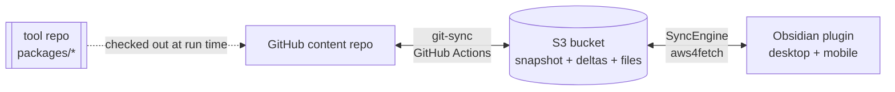

# Vault Sync System — Implementation Reference

This document describes the system **as built**. [[System Design.md|System Design.md]] captures the
original POC rationale (why a delta journal, why union merge, why S3-as-hub); read it for the
"why". This document is the "what is actually in the code": modules, data structures, algorithms,
the exact exclusion rules, configuration, and every place the shipped product extended or diverged
from the POC design. Section §12 maps design → implementation for anyone holding both docs.

> [!summary] One paragraph
> **S3 is the hub.** Two clients — a GitHub Actions **git-sync** job and an **Obsidian plugin** —
> speak one shared protocol from `packages/core`: an append-only **delta journal**
> (`deltas/<rev>.json.gz`, CAS via `If-None-Match: *`) plus a periodic **snapshot** compacted by
> git-sync. Sync traffic is proportional to *changed* files, never vault size. Conflicts resolve by
> three-way **union merge** (one implementation, both legs). The plugin adds per-device identity,
> a split settings/state persistence model, a per-device download cap, full `.obsidian` config sync
> with a per-device denylist, and a one-click "starter vault" exporter. An optional third client —
> a stateless **MCP server** on AWS Lambda — exposes a vault to MCP clients over the internet
> (design: [[MCP Server Design.md|MCP Server Design.md]], details: `packages/mcp-server/README.md`).



---

# 1. Repository layout

A TypeScript monorepo (npm workspaces). `core` is pure logic with no platform APIs, so it runs
byte-identically in the Obsidian renderer (desktop Electron **and** mobile) and on the Actions
runner — the property that guarantees both legs merge the same way.

| Path | Role |
|---|---|
| `packages/core/` | Shared protocol client. No I/O assumptions; storage + filesystem injected. |
| `packages/core/src/schemas.ts` | `Delta` / `Snapshot` / `FileEntry` / `Tombstone` types, `pad10`, `parseDelta`, tombstone/empty helpers. |
| `packages/core/src/journal.ts` | CAS append, `listDeltasSince`, `foldDeltas`, `changedEntries`, snapshot read/write, `pruneDeltas`, gap detection. |
| `packages/core/src/merge.ts` | Three-way union merge (`node-diff3`). **The** merge, shared by both legs. |
| `packages/core/src/hash.ts` | `contentHash` → `"md5:<hex>"` via `spark-md5` (pure JS). |
| `packages/core/src/codec.ts` | gzip(JSON) via `pako`; text encode/decode. |
| `packages/core/src/s3.ts` | `StorageAdapter` interface + `PreconditionFailedError`. |
| `packages/core/src/util.ts` | `mapPool` (bounded-concurrency map). |
| `packages/core/src/memory.ts` | In-memory `StorageAdapter` for tests. |
| `packages/git-sync/` | CLI run by GitHub Actions: repo ⇄ S3. |
| `packages/git-sync/src/main.ts` | The whole git-sync algorithm (state, diff, reconcile, compaction, push). |
| `packages/git-sync/src/git.ts` | Thin `git` CLI wrapper via `execa`. |
| `packages/git-sync/src/s3-adapter.ts` | `StorageAdapter` over AWS SDK v3. |
| `packages/obsidian-plugin/` | Vault ⇄ S3, desktop + mobile. |
| `packages/obsidian-plugin/src/engine.ts` | `SyncEngine`: pull/push, merge, exclusions, offline scan, download cap, resync. |
| `packages/obsidian-plugin/src/main.ts` | Plugin lifecycle, persistence, device identity, settings UI, commands. |
| `packages/obsidian-plugin/src/s3-fetch-adapter.ts` | `StorageAdapter` over `aws4fetch` (small, mobile-safe). |
| `packages/obsidian-plugin/src/logger.ts` | `SyncLogger`: rotating on-disk log + per-device S3 shipping (§4.11). |
| `packages/obsidian-plugin/src/starter.ts` | In-memory zip (`fflate`) + cross-platform delivery for the starter-vault export. |
| `packages/mcp-server/` | Optional third client: remote MCP server on Lambda (stateless, bearer-auth POC). Module map + behavior: its `README.md`; rationale: [[MCP Server Design.md\|MCP Server Design.md]]. |
| `templates/s3-sync.yml` | The Actions workflow the content repo installs. |

Build/test: `npm test` (Vitest — protocol + merge fixtures), `npm run typecheck`,
`npm run build:plugin` (esbuild → `dist/main.js`, single CJS bundle, `obsidian` external).

---

# 2. Shared protocol — `packages/core`

## 2.1 Bucket layout

```
s3://<bucket>/<prefix>/
  snapshot.json.gz            ← folded state, written only by git-sync
  deltas/<pad10(rev)>.json.gz ← append-only journal, one object per write
  files/<vault-path>          ← file contents, mirrors vault structure
  _logs/<deviceId>.log        ← plugin diagnostic log, one per device (side-channel, §4.11)
```

The `_logs/` prefix is a **side-channel outside the delta journal**: nothing reads it as vault
content, so it is invisible to both sync legs (never union-merged, never mirrored into the GitHub
repo). Only the plugin writes/reads it, and only when logging is enabled (§4.11).

`<prefix>` is optional (e.g. `vaults3sync/`) so several vaults can share a bucket — the plugin's
`prefix` setting and git-sync's `PREFIX` env must match (§7, §8). Bucket has **S3 Versioning ON**
(old versions are merge bases) and **SSE-S3** at rest.

## 2.2 Schemas (`schemas.ts`)

```ts
interface FileEntry  { hash: string; s3VersionId?: string; size: number; mtime: string }
interface Tombstone  { deleted: true }
type DeltaEntry      = FileEntry | Tombstone
interface Delta      { rev: number; by: string; at: string; files: Record<string, DeltaEntry> }
type SnapshotEntry   = DeltaEntry & { rev: number; by: string }
interface Snapshot   { schemaVersion: number; revision: number; updatedAt: string;
                       files: Record<string, SnapshotEntry> }
```

- `hash` — `"md5:<hex>"`, the **only** change signal. MD5 equals the S3 ETag for plain PUTs, so
  drift is detectable without a download.
- `mtime` — author-time metadata; never a change signal, never bumps `rev` on its own.
- `by` — writer id; `"git-sync"` for the Actions job, the device id (e.g. `macmini-8f3a`) for a
  plugin instance. Basis for echo suppression.
- `rev` — dense global counter; the delta key is zero-padded (`pad10`) so lexicographic S3 listing
  equals revision order.

## 2.3 Write algorithm — CAS append (`appendDelta`)

```
1. rev = startRev
2. PUT deltas/<pad10(rev)>.json.gz with If-None-Match:*   (files PUT by caller first)
3. 412? → GET the winner delta, hand it to onLostRace(), rev++, retry (≤100 attempts)
```

Files are PUT **before** the delta (the journal never references a missing object). The 412 loop
gives total write ordering with no locks. Revisions come out **dense** — the read side relies on
that for gap detection.

## 2.4 Read / catch-up (`listDeltasSince`, `hasGap`, `foldDeltas`, `changedEntries`)

One `LIST deltas/ start-after=<pad10(sinceRev)>` both answers "anything new?" and enumerates exactly
what to fetch. If the returned deltas don't connect to `sinceRev + 1` (`hasGap`), the journal was
pruned past this client → **cold path**: read `snapshot.json.gz`, diff the whole state.
`changedEntries` folds deltas last-writer-wins and drops entries whose `by == excludeBy` (echo
suppression). git-sync always folds `snapshot ⊕ newer deltas` (`loadRemoteState`); the plugin only
does so on the cold path.

## 2.5 Compaction & pruning (`writeSnapshot`, `pruneDeltas`)

git-sync is the **only** snapshot writer. It folds new deltas into `snapshot.json.gz`
(CAS via `If-Match` on the snapshot ETag, else `If-None-Match:*` on first write) with the revision
in `x-amz-meta-revision`, then `pruneDeltas` deletes folded deltas older than `RETENTION_DAYS`
(default 30). The snapshot carries its revision in object metadata so a client can detect
"behind retention" with a single HEAD.

Compaction is **age-gated** (`shouldCompact`, git-sync `compaction.ts`): it runs only when no
snapshot exists yet or the current one is older than `SNAPSHOT_MAX_AGE_HOURS` (default 24; `0` =
every run). Sync runs are far more frequent than that, and a fresher snapshot buys nothing —
clients always fold `snapshot ⊕ newer deltas`, so a stale snapshot just means a few more ~300 B
deltas to fold. Skipping compaction also skips pruning, which simply waits for the next rebuild.

## 2.6 Union merge (`merge.ts`)

`unionMerge(base, ours, theirs)` → `{ text, hadConflicts }`. Fast-paths equal/one-sided cases, then
`node-diff3` with `excludeFalseConflicts`. Each conflict region combines its two sides with a **2-way
LCS union** (`diffComm`): lines common to both sides survive **once**, only genuinely differing lines
stack (ours-only then theirs-only), **no markers** — nothing lost. This matters most on the
empty/unusable-base path, where diff3 collapses the whole overlap into one giant conflict region;
blind concatenation there duplicated the entire block, the dedup keeps it single. This is the single
implementation both legs import; divergent merge output would echo back through sync as phantom
changes, so both `diff3Merge` and `diffComm` must stay pure and deterministic.

**YAML frontmatter** (`frontmatter.ts`) is the same hazard one level down: line-stacking two edits of
the same property yields a duplicated key (`updated: A` / `updated: B`) that breaks Obsidian's property
parser. So when **both** sides of a note carry a frontmatter block, `unionMerge` splits it off and
merges it **per-key** — one-sided edits apply; list props (`tags`, `aliases`) union; a delete-vs-edit
keeps the edit; two differing scalars take **theirs** (the S3/remote value, so both legs converge on
the hub instead of fighting) — then union-merges only the body. Key order and re-serialization are
deterministic, and reserialization happens only on a genuine conflict (the equal/one-sided fast paths
return a side verbatim), so both legs stay byte-identical. Notes without frontmatter on both sides, or
with unparseable/non-mapping YAML, fall back to the plain line merge.

Union merge is applied only to **text notes** within the size cap. **Config files** (`.obsidian/**`)
and **binary/oversized** content resolve by **freshest-wins** instead (§4.8, §5.4) — line-merging
JSON stacked its lines into duplicated keys — and that choice, too, is duplicated byte-for-byte
across both legs.

## 2.7 Hash & codec

- `contentHash` — `spark-md5` over bytes, `"md5:<hex>"`. Pure JS → identical on mobile, desktop, CI.
- `encodeJsonGz` / `decodeJsonGz` — `pako` gzip of JSON, the wire format for snapshot + deltas.
- `mapPool(items, limit, fn)` — bounded concurrency (8 mobile, 50 desktop/CI).

---

# 3. Storage adapters (one interface, two implementations)

`StorageAdapter` (`get/head/put/list/delete`) is implemented twice so `core` never depends on a
platform:

| | Plugin — `S3FetchAdapter` | git-sync — `S3SdkAdapter` |
|---|---|---|
| Transport | `aws4fetch` (SigV4 over `fetch`) | AWS SDK v3 |
| Why | tiny bundle, works in the mobile webview | rich, runs on Node/Actions |
| CAS PUT | `If-None-Match: *` / `If-Match: <etag>` headers | SDK conditional params |
| LIST | `ListObjectsV2` XML parsed with `DOMParser`, `start-after`, continuation tokens | SDK paginator |
| Prefix | prepended/stripped around every key | prepended/stripped around every key |

> [!warning] CORS is mandatory for the plugin
> The plugin issues cross-origin requests from `app://obsidian.md` (desktop) and
> `capacitor://localhost` / `http://localhost` (mobile). The bucket **must** have a CORS config
> allowing those origins with `ETag` and `x-amz-version-id` exposed, or every request fails with
> `TypeError: failed to fetch`. git-sync (server-side SDK) is unaffected.

---

# 4. Obsidian plugin — `packages/obsidian-plugin`

## 4.1 Persistence: settings vs state (split, gzipped, change-gated)

Data is stored in **two** places, a deliberate change from the POC (which kept everything in
`data.json`):

- **`data.json`** (`saveData`) — **settings only** (`{ settings }`). Small and safe to copy between
  devices. Holds the S3 credentials.
- **`<plugin-dir>/state.json.gz`** — the heavy per-file sync state, gzipped, in a **compact schema**:
  ```ts
  type CompactEntry = [hash, mtime] | [hash, mtime, s3VersionId]
  interface CompactState { r: number; f: Record<string, CompactEntry> }
  ```
  Rationale: at 20k files a plain-JSON state is ~4 MB rewritten on every sync; the gzipped compact
  form is a fraction of that. It is written **only when state actually changed** (a no-op poll — the
  common case — skips the write). A one-time migration lifts any legacy embedded `syncState` out of
  `data.json` into the state file.

`state.json.gz` is **per-device** and is excluded from sync on both legs (§6).

## 4.2 Device identity & copy detection (`main.ts`)

Each device needs a unique, stable writer id for echo suppression, and copying a configured
`data.json` to a new device must not make two devices share an id.

- **`deviceId`** — minted on first load as `<label>-<suffix>`. The label is a slug of the desktop
  hostname or the **phone model** (`mobileModelFromUA`, e.g. `sm-g991b` / `iphone` — version numbers
  stripped). The suffix is the stable **device anchor** on mobile and a random nibble on desktop; it
  guarantees uniqueness even across identical hardware.
- **device anchor (mobile)** — a random token minted once and kept in this device's
  **`localStorage`** (`DEVICE_ANCHOR_KEY`), **never written to `data.json`**. Because it isn't part of
  the bundle it can't be copied to another device, and because it isn't derived from the User-Agent it
  **doesn't fluctuate** when the OS / WebView / app updates. (Earlier builds fingerprinted the raw
  `ua:<userAgent>`, whose embedded version numbers changed on their own and minted phantom "new
  devices" → spurious foreign-state resyncs.) An app reinstall / cache-wipe clears it, which correctly
  reads as a new device.
- **`machineFingerprint`** — recomputed every load (`host:<hostname>` on desktop, `anchor:<anchor>`
  on mobile) and **never trusted from disk**. On load:
  - no `deviceId` → mint one, record the fingerprint;
  - legacy fingerprint (empty, or the old `ua:` scheme) → adopt the stable fingerprint in place and
    keep the id — a one-time upgrade migration, **no** foreign-state resync;
  - fingerprint present but different → the `data.json` was **copied from another machine**:
    mint a fresh `deviceId`, reset the sync cursor to 0, and flag a **foreign-state full resync** on
    startup (so the copied device rebuilds its own state and pulls the whole vault instead of
    trusting a stranger's cursor).

## 4.3 Sync cycle (`SyncEngine.sync` → `pull` + `push`)

One cycle: **pull** remote changes (merge conflicts), then **push** the dirty set. `sync(fullPull)`
resets per-cycle counters, and persists state only when something changed or the cursor moved.

- **pull** — `listDeltasSince(lastSyncedRev)`. Warm path applies `changedEntries` (excluding this
  device unless `fullPull`); cold path (`hasGap` or behind snapshot) diffs the snapshot. For each
  changed path not excluded/unsafe → `applyRemote`. Advances `lastSyncedRev` to the target.
- **push** — snapshots and **drains** the dirty set up front (so an edit that lands mid-cycle
  re-populates `dirty` and is pushed next cycle instead of being wiped by a blanket clear — the fix
  for edits lost during a slow push); then hashes each drained file; **hash unchanged → dropped**
  (mtime-only touch, no traffic). Uploads changed files, then one `appendDelta` written
  `by: deviceId`. On a lost CAS race it applies the winner's foreign entries before retrying.
  Tombstones are emitted for dirty paths whose file is gone. On failure the drained paths are
  requeued for the next cycle.

Echo suppression is **disabled during a full resync** (`excludeBy = undefined`) so a device can
restore files *it* originally wrote but has since lost locally — the fix for "resync pulled 0 files".

## 4.4 Change tracking & offline scan (`scanOffline`)

Vault events (`create/modify/delete/rename`) feed the dirty set while running (5 s debounce before a
push). Events don't fire while the app is closed, so `scanOffline` on startup diffs the vault against
stored state: an mtime pre-filter picks candidates, the hash decides. New files join the dirty set;
missing files are treated as offline deletes — **except** the mass-missing guard:

> [!note] Startup runs the pull before the scan
> On mobile the offline scan takes minutes (it walks the whole vault + `.obsidian`), so startup
> does a bare remote **pull first** and runs `scanOffline` **afterwards, in the background** — cloud
> changes land in seconds instead of queueing behind the scan. This is safe because `applyRemote`
> re-hashes each local file, so an offline edit that *also* changed remotely still conflict-merges
> during the pull; only **pure-local** offline edits/deletes (invisible to the pull) wait for the
> scan to push them up.

> [!important] Mass-missing guard (offline-delete safety)
> If ≥ `MASS_MISSING_MIN` (10) tracked files are missing **and** they exceed
> `MASS_MISSING_FRACTION` (50%) of tracked files, that is almost certainly a stale/copied/moved
> state, not real deletions. Rather than tombstone (which would wipe the vault everywhere), the
> engine resets `lastSyncedRev = 0` and **restores from S3**. Below the floor, missing files
> propagate as normal tombstones.

> [!important] Case-only renames on case-insensitive filesystems
> A rename that changes only letter case (e.g. `My Note` → `My note`) leaves the **old-cased** path
> in the dirty set. On macOS/iOS (case-insensitive APFS/HFS+) `adapter.stat(oldPath)` resolves to the
> *new* file, so the old path looks alive and `push()` would re-upload it — a phantom duplicate that
> only materializes on case-**sensitive** peers (Android/Linux), where the two casings are distinct
> files. `push()` guards against this by listing the parent dir: a stat'd path is treated as
> renamed-away (→ tombstone) only when its exact-case basename is **absent** yet a different-cased
> variant is **present**. Positive evidence only — an empty/unreadable listing falls back to trusting
> `stat`, so an incomplete listing never wrongly tombstones a live file.

## 4.5 Resync everything (`resyncEverything`)

The escape hatch: clear cursor + state, re-scan all local files as new, then `sync(fullPull=true)`
(no echo suppression) so the entire live S3 state is reconciled and overlaps union-merge. Persisted
even if S3 was empty. Exposed as a command and a warning-styled settings button.

## 4.6 Exclusions & `.obsidian` config sync (`isExcluded`)

The matured plugin **syncs `.obsidian`** (app settings, themes, snippets, plugin enable-lists, and
every plugin's code *and* settings) so a vault is fully reproducible across devices — a reversal of
the POC, which excluded `.obsidian` wholesale. Only a small **per-device denylist** is held back.
`isExcluded(path)` returns true for:

- `GIT_META_FILES` by basename: `.gitignore`, `.gitattributes`, `.gitmodules`, `.s3syncignore`
  (a vault lacking these must not tombstone them out of the repo);
- `isPerDeviceFile(path)`: basename `.DS_Store` or `state.json.gz`, or `.obsidian/workspace*.json`;
- **this plugin's own** per-device files under `<selfDir>` — `data.json` (AWS creds), `sync.log`, and
  `sync.log.1` (the diagnostic log + its rotation backup, §4.11). Matched by the full `<selfDir>/…`
  path (basename set `SELF_DIR_EXCLUDED`) so **other** plugins' `data.json`/`sync.log` still sync;
- `ALWAYS_EXCLUDED` prefixes: `.sync/`, `.git/`, `.github/`, `.sync-tool/`, `.trash/`;
- user-configured `excludedFolders` (local-only until re-enabled; re-enabling is a scoped first-run
  union merge).

This denylist is kept in **lockstep** with git-sync's ignore set (§6) so neither leg tombstones what
the other keeps — the failure mode that once deleted `.gitignore` from the repo.

## 4.7 Per-device download size limit

`maxDownloadBytes` (from the `maxDownloadMB` setting; **default 10 MB**, `0` = unlimited) caps
**downloads** on this device: in `applyRemote`, a clean/absent local file whose remote `size` exceeds
the cap is **skipped before the GET** (checked against the manifest's size — no wasted bandwidth) and
**not recorded**, so it's simply absent here, never mistaken for a deletion. Uploads are never capped
— a large file authored on the device still syncs up. A locally-dirty file is exempt (it must be
resolved and already occupies space). Skips are counted and surfaced in the verbose notice; raising
the cap and running Resync fetches previously-skipped files. The setting lives in per-device
`data.json`, so phones keep 10 MB while the laptop can set 0.

### 4.7.1 On-demand force-download of a note's linked files

The **`Force download linked files of this note`** command (active-note `checkCallback`) lets a capped
device pull a specific note's oversized attachments without lowering the global cap or a full resync.
`main.ts` collects the note's link/embed targets as Obsidian **linkpaths** — from
`metadataCache.resolvedLinks` **and** the raw `links`/`embeds` in the file cache, so targets that
aren't present locally (the whole point) still surface — strips heading/block subpaths via
`getLinkpath`, and hands them to `SyncEngine.forceDownloadPaths`. The engine runs this as a normal
**serialized cycle** (`forcePaths` on the request; coalesces like any other): it loads the full live
remote state (`loadRemoteState`), resolves each linkpath to a live remote path (exact, then `+".md"`
for wikilinks, then basename/suffix match with shortest-path tiebreak; tombstones never match), and
fetches each clean/absent target **ignoring `maxDownloadBytes`**, recording it in state. Locally-dirty
targets are left for normal reconcile; unmatched candidates are reported. The command surfaces a
`downloaded N, M already present, K not found in cloud` notice. Because the fetched files are now
tracked and present, they aren't re-uploaded; a later remote edit that's still over the cap is skipped
as usual (the forced copy goes stale until the command is re-run), never deleted.

## 4.8 Conflict handling & mtime alignment (`applyRemote`)

`applyRemote` per path: identical hash → just record; clean local (or absent) → take remote (subject
to the download cap); local also changed → **conflict**. Conflict strategy depends on the path
(`usesFreshestWins`):

- **Text notes** within `LWW_SIZE_LIMIT` (5 MB) → three-way **union-merge** against the versioned
  base (fetched via the recorded `s3VersionId`). The merged bytes are written and left **dirty** so
  `push` uploads them; the engine does **not** `record()` the merged hash here — doing so would make
  `push`'s mtime-only-touch guard (`st.hash === hash`) treat the merge as a no-op and silently drop
  the upload, stranding the resolved conflict on this device (the bug that lost mobile-side merges).
- **Config files** (`.obsidian/**`) and **binary / oversized** content → **freshest-wins**
  (`resolveFreshestWins`): whichever side has the newer `mtime` takes the whole file — remote newer →
  download + record; local newer (or a tie) → keep local + re-push. Line-merging JSON duplicated its
  lines; freshest-wins avoids that **and converges**, where the previous keep-local rule ping-ponged
  a fresh delta every poll between two divergent copies. No bytes are synthesized, so both legs stay
  convergent even under clock skew.

> [!note] Resync is authoritative for config (`takeConfigFromRemote`)
> On a **full-pull reconcile** (`resyncEverything`), config-dir collisions are taken from S3 **as-is**
> instead of freshest-wins. This is the **heal path** for a device whose `.obsidian/*.json` a prior
> bad merge corrupted locally: the corrupted copy carries a *newer* mtime and would otherwise win
> freshest-wins and re-propagate the corruption, so a resync forces the correct S3 copy back down.
> Notes still union-merge on resync (lossless). Bootstrap (first-run) already takes every collision
> from remote, so it covers config too.

> [!note] First-run bootstrap (`EngineOptions.firstRun`)
> On a device that has **never synced** (no persisted state file, and not a copied/foreign state),
> the first pull treats every local↔remote collision as **clean → take remote as-is** rather than a
> conflict. A fresh vault's `.obsidian/*.json` on disk is Obsidian's just-generated *defaults*, not
> real edits; union-merging them would corrupt the canonical settings and propagate the corruption on
> the next push. Local-only files (absent from remote) never reach `applyRemote`, so genuine new
> content still uploads. The guard clears after the first pull. It is deliberately **off** for a
> foreign (copied) state and for user `Resync everything`, where local content is real and the
> lossless union merge is correct. The plugin sets `firstRun = !hadPriorState && !foreignStateDetected`.

Remote writes
land with the **manifest's mtime** (`DataWriteOptions`), so sort-by-modified is consistent across
devices and the offline pre-filter stays trustworthy. Writes made by sync are wrapped in an
`applying` set (released after 500 ms) so the resulting vault event is recognized as an echo, not a
new edit.

## 4.9 UX: notices, settings, commands

- **Verbose mode** (default off): a notice after every cycle that transferred anything —
  `Sync: ↓<pulled> ↑<pushed> (<merged> merged) · <skipped> kept in cloud (over size limit)`. Errors
  and merge conflicts always notify regardless.
- **Pause sync** (`settings.syncPaused`, default off): a plugin-level gate — startup/poll/edit
  cycles no-op and manual sync/resync are refused with a notice, while dirty tracking keeps running
  so edits flush the moment sync resumes. Use it to finish enabling/configuring plugins on a new
  device before the first sync, or to stop temporarily. Resuming (settings toggle or command) kicks
  an immediate sync and restarts polling.
- **Settings tab**: **pause sync** (top), bucket, region, access key id, secret (password field),
  key prefix, poll interval (≥ 5 s), excluded folders, **max download size (MB)**, device id, verbose
  toggle, **Resync everything** (warning), **Export setup vault** (CTA).
- **Commands**: `Sync now`, `Resync everything from S3`, `Pause/resume sync`,
  `Export setup vault (for a new device)`,
  `Force download linked files of this note (ignore size limit)` (§4.7.1; active-note only).
- **Polling**: `LIST` every `pollIntervalSec` (default 15). Once the vault index is ready, startup
  runs in two phases (§4.4): a bare remote **pull** first (fast — cloud changes land in seconds),
  then it starts polling, then the full **`scanOffline`** catch-up in the background.

## 4.10 Starter-vault export (`starter.ts`)

Provisions a new device from **any** device (desktop or mobile) — no CLI. `buildStarterZip` assembles
an in-memory zip (`fflate`) containing an empty `vault/` with only this plugin (`main.js` +
`manifest.json`), `community-plugins.json` pre-listing the plugin, and a `data.json` that is **plugin
defaults + this device's connection fields** with `deviceId`/`machineFingerprint` cleared,
`maxDownloadMB = 10`, `syncPaused = true` (§4.9 — the new device enables/configures its plugins,
then resumes sync to pull the vault), and **no state file** (clean full pull on first run, taking
remote as-is on every collision per the §4.8 bootstrap). Setup instructions ride at
the zip **root**, outside `vault/`, so they never sync to S3. `deliverFile` adapts to platform:
`navigator.share({ files })` (mobile share sheet) with a browser-download fallback (desktop).

> [!caution] The starter zip contains the AWS secret key
> It must, so the new device can connect. The button description and bundled README warn to transfer
> it privately and delete it after setup.

## 4.11 Diagnostic logging (`logger.ts`)

Because mobile Obsidian has **no developer console**, field issues (duplication, conflicts, silent
no-ops) were previously un-debuggable. `SyncLogger` gives a persistent, browsable trail. It is
**off by default** — the `loggingEnabled` setting (per-device `data.json`) gates it, so with logging
off there are no disk writes, no S3 PUTs, and no note paths leave the device.

- **On disk.** Timestamped lines (`<ISO> LEVEL message`, levels `INFO/WARN/ERROR`) are buffered and
  flushed on a ~1 s debounce to `<selfDir>/sync.log`. When the active file passes **512 KB** it rolls
  to `sync.log.1` (one backup kept) and a fresh active file starts. Both are per-device and excluded
  from sync (§4.6). Every op is wrapped — **logging never throws into the sync path**. Lines also
  mirror to the console so desktop DevTools still works.
- **Sources.** The engine receives a `log(level, msg)` callback via `EngineOptions`: every `Notice`
  it raises is also logged, plus per-cycle transfer summaries and `WARN` on union-merge conflicts.
  `main.ts` logs lifecycle events (startup, pause/resume, foreign-state resync, manual resync) and
  routes its former `console.error` sites through `logger.error`.
- **Per-file detail (log-only).** Beyond the count summary, each cycle logs **which** files moved,
  one greppable line per file, arrow-tagged to match the summary: `↓ pulled <path>` / `↓ deleted
  <path>` (removed locally by a remote tombstone) / `↑ pushed <path>` / `↑ deleted <path>`
  (tombstoned in the cloud) / `⇅ merged <path>` (union-merge or freshest-wins; a merged file is
  listed once, not re-listed as a push). This detail goes **only to the log**, never a `Notice` — a
  transient toast can't hold a file list. Each direction is capped at **20 paths** per cycle
  (`LOG_LIST_CAP`), the excess collapsing to `… and N more`, so a resync/first-sync moving thousands
  of files can't flood the 512 KB rotating file or the S3 tail; the summary counts stay exact.
- **S3 shipping.** After each sync cycle (piggybacking the poll cadence, no extra timer),
  `uploadIfDirty()` PUTs this device's recent tail (~256 KB) to `_logs/<deviceId>.log` — but only
  when logging is on and there is new content since the last upload. This is a side-channel outside
  the journal (§2.1), so logs never union-merge and never reach the GitHub repo.
- **Settings viewer.** A "Logs" section offers the on/off toggle, a **per-device picker** (This
  device — read fresh from disk — plus every device found under `_logs/`, newest first), a read-only
  monospace viewer showing the tail **newest line first**, and Refresh / Copy / **Clear logs**. Clear
  wipes this device's local files and its own `_logs/<deviceId>.log`; other devices' remote logs are
  untouched.

> [!note] Privacy
> Log lines contain **note paths** (never credentials). Shipping to `_logs/` exposes those paths to
> anyone who can read the bucket — the same audience that already holds the entire vault (§10).

---

# 5. git-sync — `packages/git-sync`

Runs in GitHub Actions (`templates/s3-sync.yml`), triggered by push to `main`, a 4-hourly cron
(catches plugin-side changes; compaction is age-gated to ~daily, §2.5), or manual dispatch. `concurrency: s3-sync,
cancel-in-progress: false` serializes runs; CAS guards cross-client races. Auth is **OIDC → IAM
role** (no stored keys). It treats the *repo* as its "local vault" and `writer id = "git-sync"`.

`actions/checkout` pins `github.sha` (the trigger commit), so a run queued behind another executes
against a checkout already behind `origin/main` — the earlier run pushed its `[skip ci]` sync commit.
To avoid a non-fast-forward `git push`, the tool first `git fetch`es and `reset --hard`s to
`origin/<branch>` (serialized runs ⇒ our push then fast-forwards); the push is also retried with a
rebase of its lone sync commit if the branch still advances mid-run (rare external push).

## 5.1 State

`.sync/state.json` — `{ lastSyncedRev, lastSyncedCommit }`, **committed to the repo** (versioned with
the content it describes, survives runner teardown). Per-file hashes aren't stored; git blob hashes +
manifest hashes reconstruct everything.

## 5.2 Change detection

- **Git side**: if `lastSyncedCommit` is an ancestor of `HEAD` (warm), `git diff --name-status`
  from the **diff base** (renames become delete+add); else (history rewritten / first run) fall back
  to `ls-files` full diff. Ignored paths and unsafe paths are dropped.
  The diff base is git-sync's **own last sync commit** when it sits at/after the cursor
  (`resolveDiffBase`, `merge-base.ts`), not `lastSyncedCommit` itself: the cursor is the pre-commit
  HEAD, so diffing from it would re-report the last sync commit's own S3-applied writes as git
  edits — harmless for files still live in S3 (hash idempotence) but fatal for a path the vault has
  since renamed/deleted, where the false "edit" would beat the tombstone (edit-wins) and resurrect
  the old file with stale content.
- **S3 side**: always `readSnapshot` ⊕ `listDeltasSince` (Actions bandwidth is free → uniform
  warm/cold). Entries with `rev > lastSyncedRev` and `by != "git-sync"` become `s3Changed`.

## 5.3 Exclusions & oversized-file guard

Three mechanisms combine into one `ignore` matcher (`ig`), applied in **both** directions:

1. **`.s3syncignore`** (repo root, gitignore syntax) — GitHub-only folders, never pushed to S3.
2. **Hard-coded set** — `.sync/state.json`, `.s3syncignore`, `.sync/`, `.github/`, `.sync-tool/`,
   `.gitignore`, `.gitattributes`, `.gitmodules`, `.git/`, `.DS_Store`, `.trash/`,
   `.obsidian/workspace*.json`, `state.json.gz`, `.obsidian/plugins/vault-s3-sync/data.json`.
   Enforced here (not only via `.gitignore`) so a missing/misconfigured `.gitignore` can't leak them.
3. **`.gitignore`** — for **S3 → git** only, `git check-ignore` keeps ignored paths S3-only (they
   stay plugin-visible but never enter the repo).

**Oversized guard**: files whose manifest `size` exceeds `GIT_MAX_FILE_BYTES` (default **25 MB**)
stay S3-only — never written into the git tree — so a large attachment can't wedge the push against
GitHub's 100 MB limit. (No download needed; the size is in the manifest.)

## 5.4 Reconcile

The per-path decision lives in `reconcileFile` (`reconcile.ts`) behind a small `ReconcileIO` seam, so
it is unit-tested without a real repo/S3/filesystem (`test/reconcile.test.ts`). For each path in
`gitChanged ∪ s3Changed` (50-way parallel):

- git-only upsert → PUT to S3 if the content hash differs from remote (idempotence); git-only delete
  → tombstone if remote still lives.
- S3-only → write into the working tree, or `rm` on a tombstone.
- both → resolve: delete-vs-edit → edit wins; else classify like the plugin (§4.8, kept in lockstep):
  - **config (`.obsidian/**`) or binary/oversized** → **freshest-wins**: compare `io.authorDate` (git
    side) against the S3 entry's `mtime`; remote newer → write remote to the tree, no push; git newer
    (or a tie) → keep git's bytes and re-push. Mirrors the plugin's `resolveFreshestWins` so JSON
    isn't line-merged into duplicated keys and neither side ping-pongs.
  - **text note within `LWW_SIZE_LIMIT`** → three-way `unionMerge` with
    `base = git show <last own sync commit>:<path>` (falling back to the warm cursor, then empty —
    `makeMergeBaseResolver`, `merge-base.ts`), writing the result to the tree **and** queuing the
    S3 PUT.

> [!important] Content is handled as **raw bytes** end to end
> Local reads/writes and S3 get/put move `Uint8Array`; text is decoded (`decodeText`) only inside the
> union-merge branch above. Reading or writing a binary file as UTF-8 replaces every invalid byte with
> U+FFFD — irreversibly corrupting it and inflating its size (~1.5–2×). The `TEXT_EXTS` / `LWW_SIZE_LIMIT`
> classification is duplicated here to stay in lockstep with the plugin's `engine.ts` (§4.8).

## 5.5 Write cycle, compaction, commit

PUT changed files (recording `s3VersionId`), then one `appendDelta` `by: "git-sync"`. Compaction —
when the snapshot is past `SNAPSHOT_MAX_AGE_HOURS` (§2.5) — folds all new deltas into the snapshot
(CAS) and prunes deltas older than `RETENTION_DAYS`. Finally
write `.sync/state.json` with the new rev and the **pre-commit** `HEAD`, `git add -A`, and if
anything is staged, commit `s3-sync: rev <N> [skip ci]` as `s3-sync-bot` and push. `[skip ci]` + the
bot author are the git-side half of echo suppression (the push doesn't re-trigger the workflow).

`lastSyncedRev` advances only over revisions this run actually **reconciled** — the fold read at
the start — never to the rev of its own delta or the compacted snapshot. Deltas that landed mid-run
(or won a CAS race against git-sync's append) were not applied to the tree, so the cursor must not
skip them: git-sync's own entries are echo-suppressed by `by` next run, while foreign ones get
picked up then. (The old `max(own rev, snapshot rev)` cursor silently dropped such vault edits from
git until the same file was next touched.)

## 5.6 Prefix

`PREFIX` (env / `S3_SYNC_PREFIX` repo variable) namespaces every S3 key and **must** equal the
plugin's `prefix` setting. This is how multiple vaults share one bucket.

---

# 6. Exclusion matrix (both legs, kept in lockstep)

The two legs must agree exactly: if one syncs a file the other tombstones, they fight. Current rules:

| Path / pattern | Plugin (Obsidian ⇄ S3) | git-sync (git ⇄ S3) | Reason |
|---|:--:|:--:|---|
| `.obsidian/**` (general) | **syncs** | **syncs** | distribute app + plugin config |
| other plugins' `data.json` | syncs | syncs | distribute plugin settings |
| `community-plugins.json`, `core-plugins.json` | syncs | syncs | auto-enable plugins everywhere |
| `vault-s3-sync/data.json` | excluded | excluded | our AWS creds, per-device |
| `vault-s3-sync/sync.log`, `sync.log.1` | excluded | excluded | per-device diagnostic log (§4.11) |
| `state.json.gz` | excluded | excluded | per-device sync cursor |
| `.obsidian/workspace*.json` | excluded | excluded | per-device UI layout |
| `.DS_Store` | excluded | excluded | OS cruft |
| `.trash/` | excluded | excluded | local trash |
| `.gitignore` / `.gitattributes` / `.gitmodules` / `.s3syncignore` | excluded | excluded | git metadata; absence must not tombstone |
| `.git/`, `.github/`, `.sync/`, `.sync-tool/` | excluded | excluded | repo/tool infrastructure |
| files `> 25 MB` | download-capped per device (§4.7) | S3-only (`GIT_MAX_FILE_BYTES`) | keep repo/mobile lean |
| user `excludedFolders` | excluded (local-only) | — | plugin-side opt-out |
| `.s3syncignore` entries | — | GitHub-only | git-side opt-out |

---

# 7. Configuration reference

## 7.1 Plugin settings (`data.json`, per-device)

| Setting | Default | Notes |
|---|---|---|
| `bucket` / `region` | — / `us-east-1` | S3 target |
| `accessKeyId` / `secretAccessKey` | — | IAM user creds (SigV4) |
| `prefix` | `""` | must equal git-sync `PREFIX` |
| `deviceId` | minted `<label>-<suffix>` | writer id; auto (mobile suffix = localStorage anchor) |
| `machineFingerprint` | recomputed | copy detection; never trusted from disk (mobile: `anchor:`, not the UA) |
| `pollIntervalSec` | 15 | min 5 |
| `excludedFolders` | `[]` | local-only until re-enabled |
| `maxDownloadMB` | **10** | 0 = no limit |
| `verbose` | false | notice on every active cycle |
| `mobileConcurrency` / `desktopConcurrency` | 8 / 50 | transfer parallelism |
| `loggingEnabled` | **false** | disk + S3 diagnostic log (§4.11) |

## 7.2 git-sync env (set by the workflow)

| Env | Purpose |
|---|---|
| `BUCKET` | S3 bucket (required) |
| `PREFIX` | key prefix (from `S3_SYNC_PREFIX`) |
| `AWS_REGION` | region |
| `REPO_DIR` | content repo working dir (`github.workspace`) |
| `RETENTION_DAYS` | delta retention (default 30) |
| `SNAPSHOT_MAX_AGE_HOURS` | rebuild snapshot at most this often (default 24, `0` = every run) |
| `GIT_MAX_FILE_BYTES` | oversized cutoff (default 25 MB) |

## 7.3 Content-repo variables (GitHub Actions)

`S3_SYNC_BUCKET`, `S3_SYNC_REGION`, `S3_SYNC_ROLE_ARN`, `S3_SYNC_TOOL_REPO`, and optionally
`S3_SYNC_PREFIX`. See **SETUP.md** for the full bootstrap (bucket + versioning + CORS, OIDC provider
+ IAM role, workflow install, plugin install).

---

# 8. Deployment & infrastructure

- **S3 bucket** — versioning **required** (merge bases), SSE-S3 at rest, private, **CORS** for
  `app://obsidian.md` / `capacitor://localhost` / `http://localhost` exposing `ETag` +
  `x-amz-version-id`.
- **Auth** — GitHub **OIDC provider** → **IAM role** with a bucket-scoped policy assumed by the
  workflow (`role-to-assume`); no long-lived keys in CI. The plugin uses a separate IAM **user**'s
  access key (the only long-lived credential, and it lives only in per-device `data.json`).
- **Workflow** — `templates/s3-sync.yml` installed at the content repo's
  `.github/workflows/s3-sync.yml`; it checks out the content repo (full history) **and** the tool
  repo into `.sync-tool/`, then runs `tsx packages/git-sync/src/main.ts`.
- **Multi-vault** — one bucket, distinct `PREFIX`/`prefix` per vault.
- **MCP server (optional)** — one Lambda + Function URL per vault (`scripts/install/05`), execution
  role scoped like the plugin user's policy. No state of its own — reads fold `snapshot ⊕ deltas`
  per request, writes CAS-append `by: "mcp"`. See `packages/mcp-server/README.md`.
- **Plugin distribution** — because `.obsidian` now syncs, a new `main.js` committed/synced into one
  vault propagates to all devices as ordinary vault content; the starter-vault export bootstraps a
  brand-new device.

---

# 9. Failure & recovery

| Failure | Recovery |
|---|---|
| Delta write race (same rev) | 412 → apply winner, retry at rev+1 (~300 B) |
| Client crash mid-push | files-before-delta ordering → no dangling refs; dirty set persisted |
| Client behind retention | cold path: fetch snapshot, full diff, resume deltas |
| Divergent offline edits | three-way union merge via versioned base |
| Copied `data.json` / stale state | fingerprint mismatch → fresh id + foreign-state full resync |
| Mass local disappearance | mass-missing guard restores from S3 instead of tombstoning |
| Oversized attachment | stays S3-only (git 25 MB guard; per-device download cap) |
| `.gitignore`/metadata absent on one client | `GIT_META_FILES` exclusion on both legs prevents tombstoning it |
| Sync loop | dual echo suppression: `by` field + `[skip ci]` bot commits |
| Corrupt S3 object | manifest hash mismatch on apply → skip/re-fetch |
| "Resync pulled 0 files" | resync uses `fullPull` (no echo suppression) → restores own lost files |

---

# 10. Security model

- **Credentials at rest**: only in per-device `data.json`, which is **never** synced (excluded on both
  legs by full path). The plugin's IAM user key is the sole long-lived credential; CI uses OIDC.
- **Blast radius**: IAM policies are bucket-scoped. The content repo is **private**; syncing every
  plugin's `data.json` means any secret a third-party plugin stores there is distributed to S3 + the
  private repo — an accepted trade-off, mitigated by repo privacy.
- **Starter zip**: contains the secret key by necessity; treated as a credential (warned, meant to be
  deleted after use).
- **Encryption**: SSE-S3 (at rest) + TLS (in transit). Client-side encryption was rejected in the POC
  because the git repo holds a plaintext copy anyway.

---

# 11. Tunable constants

| Constant | Value | Where |
|---|---|---|
| Poll interval | 15 s (min 5) | plugin `pollIntervalSec` |
| Push debounce | 5 s | `PUSH_DEBOUNCE_MS` (main.ts) |
| Transfer concurrency | 8 mobile / 50 desktop / 50 CI | settings / `CONCURRENCY` |
| Download cap | 10 MB (0 = off) | plugin `maxDownloadMB` |
| Union-merge cutoff | 5 MB / binary → LWW | `LWW_SIZE_LIMIT` (engine.ts) |
| Mass-missing guard | ≥10 files **and** >50% | `MASS_MISSING_MIN` / `MASS_MISSING_FRACTION` |
| Oversized git file | 25 MB | `GIT_MAX_FILE_BYTES` / `DEFAULT_MAX_GIT_FILE_BYTES` |
| Delta retention | 30 days | `RETENTION_DAYS` |
| Snapshot max age (compaction gate) | 24 h | `SNAPSHOT_MAX_AGE_HOURS` / `DEFAULT_SNAPSHOT_MAX_AGE_HOURS` (compaction.ts) |
| `applying` echo window | 500 ms | engine.ts |
| CAS attempts | 100 | `appendDelta` |
| Log rotation cap | 512 KB active → `.1` backup | `ROTATE_BYTES` (logger.ts) |
| Log S3 upload tail | 256 KB | `UPLOAD_BYTES` (logger.ts) |
| Log flush debounce | 1 s | `FLUSH_DEBOUNCE_MS` (logger.ts) |
| Log S3 namespace | `_logs/<deviceId>.log` | `LOG_PREFIX` (logger.ts) |

---

# 12. What changed vs the POC design doc

Everything in [[System Design.md|System Design.md]] still holds at the protocol level. The matured
implementation added or diverged as follows:

| Area | POC design | Implemented |
|---|---|---|
| Plugin persistence | all state in `data.json` (`saveData`) | **split**: `data.json` = settings only; `state.json.gz` = gzipped compact state, change-gated writes |
| Device id | `device:<name>`, manually set | **auto** `<label>-<suffix>` + machine fingerprint (mobile = localStorage anchor, update-proof); copy detection → auto full resync |
| `.obsidian` | excluded wholesale | **synced** (app/plugins/settings) minus a per-device denylist |
| Exclusions | `.gitignore` + `.s3syncignore` | + `GIT_META_FILES`, per-device denylist, both legs in **lockstep** |
| Large files | LWW over 5 MB (merge only) | + **25 MB** git guard (S3-only) + **per-device download cap** (default 10 MB) |
| Offline deletes | tombstone missing files | + **mass-missing guard** (restore, don't wipe) |
| Manual recovery | (implicit) | **Resync everything** command/button with `fullPull` (no echo suppression) |
| New-device setup | manual | **one-click starter-vault export** (in-plugin, mobile-capable, `fflate`) |
| Feedback | silent | **verbose mode** with per-cycle counters |
| Multi-vault | single bucket | **`prefix` / `PREFIX`** namespacing |
| Snapshot `updatedBy` | in schema example | not stored (folded `Snapshot` has `schemaVersion/revision/updatedAt/files`) |
| Tombstone GC | prune > 90 days | **not implemented** — tombstones persist in the snapshot; only deltas are pruned (30 days) |
| Branch protection | bot bypass / auto-PR option | direct push by `s3-sync-bot` with `[skip ci]` |
| Sync cadence | `*/15` cron, compaction every run | **4-hourly** cron; snapshot rebuild **age-gated** to ~daily (`SNAPSHOT_MAX_AGE_HOURS`) |

> [!note] Known gap
> The 90-day tombstone garbage-collection from the design is **not** implemented: `foldDeltas`
> keeps tombstones in the snapshot indefinitely, and `pruneDeltas` only removes folded deltas past
> the retention window. Tombstones are small, so this is a slow snapshot-growth concern, not a
> correctness one — a candidate for a future compaction pass.
