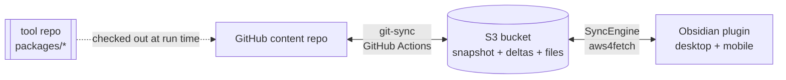

# Vault Sync System — Implementation Reference

This document describes the system **as built**. [[System Design.md|System Design.md]] captures the
original POC rationale (why a delta journal, why union merge, why S3-as-hub); read it for the
"why". This document is the "what is actually in the code": modules, data structures, algorithms,
the exact exclusion rules, configuration, and every place the shipped product extended or diverged
from the POC design. Section §12 maps design → implementation for anyone holding both docs.

> [!summary] One paragraph
> **S3 is the hub.** Two clients — a GitHub Actions **git-sync** job and an **Obsidian plugin** —
> speak one shared protocol from `packages/core`: an append-only **delta journal**
> (`deltas/<rev>.json.gz`, CAS via `If-None-Match: *`) plus a periodic **snapshot** compacted by
> git-sync. Sync traffic is proportional to *changed* files, never vault size. Conflicts resolve by
> three-way **union merge** (one implementation, both legs). The plugin adds per-device identity,
> a split settings/state persistence model, a per-device download cap, full `.obsidian` config sync
> with a per-device denylist, and a one-click "starter vault" exporter. An optional third client —
> a stateless **MCP server** on AWS Lambda — exposes a vault to MCP clients over the internet
> (design: [[MCP Server Design.md|MCP Server Design.md]], details: `packages/mcp-server/README.md`).



---

# 1. Repository layout

A TypeScript monorepo (npm workspaces). `core` is pure logic with no platform APIs, so it runs
byte-identically in the Obsidian renderer (desktop Electron **and** mobile) and on the Actions
runner — the property that guarantees both legs merge the same way.

| Path | Role |
|---|---|
| `packages/core/` | Shared protocol client. No I/O assumptions; storage + filesystem injected. |
| `packages/core/src/schemas.ts` | `Delta` / `Snapshot` / `FileEntry` / `Tombstone` types, `pad10`, `parseDelta`, tombstone/empty helpers. |
| `packages/core/src/journal.ts` | CAS append, `listDeltasSince`, `foldDeltas`, `changedEntries`, snapshot read/write, `pruneDeltas`, gap detection. |
| `packages/core/src/merge.ts` | Three-way union merge (`node-diff3`). **The** merge, shared by both legs. |
| `packages/core/src/history.ts` | Per-file version history off the journal (`fileHistory`, `readFileHistory`, `readVersionContent`, `lineDiff`) — §2.9. |
| `packages/core/src/hash.ts` | `contentHash` → `"md5:<hex>"` via `spark-md5` (pure JS). |
| `packages/core/src/codec.ts` | gzip(JSON) via `pako`; text encode/decode. |
| `packages/core/src/s3.ts` | `StorageAdapter` interface + `PreconditionFailedError`. |
| `packages/core/src/util.ts` | `mapPool` (bounded-concurrency map). |
| `packages/core/src/memory.ts` | In-memory `StorageAdapter` for tests. |
| `packages/git-sync/` | CLI run by GitHub Actions: repo ⇄ S3. |
| `packages/git-sync/src/main.ts` | The whole git-sync algorithm (state, diff, reconcile, compaction, push). |
| `packages/git-sync/src/git.ts` | Thin `git` CLI wrapper via `execa`. |
| `packages/git-sync/src/s3-adapter.ts` | `StorageAdapter` over AWS SDK v3. |
| `packages/git-sync/src/notify.ts` | `createRevPublisher`: announce a rev over IoT Data (HTTPS). Shared with mcp-server (§4.14). |
| `packages/obsidian-plugin/` | Vault ⇄ S3, desktop + mobile. |
| `packages/obsidian-plugin/src/engine.ts` | `SyncEngine`: pull/push, merge, exclusions, offline scan, download cap, resync. |
| `packages/obsidian-plugin/src/main.ts` | Plugin lifecycle, persistence, device identity, settings UI, commands. |
| `packages/obsidian-plugin/src/s3-fetch-adapter.ts` | `StorageAdapter` over `aws4fetch` (small, mobile-safe). |
| `packages/obsidian-plugin/src/poll-schedule.ts` | Pure adaptive-poll tier selection (§4.9a) — no DOM, unit-tested. |
| `packages/obsidian-plugin/src/notify.ts` | `ChangeNotifier`: MQTT-over-WSS subscribe/publish, presign, backoff (§4.14). |
| `packages/obsidian-plugin/src/mqtt.ts` | Hand-rolled QoS-0 MQTT 3.1.1 codec — pure, unit-tested (§4.14). |
| `packages/obsidian-plugin/src/logger.ts` | `SyncLogger`: rotating on-disk log + per-device S3 shipping (§4.11). |
| `packages/obsidian-plugin/src/history-modal.ts` | `VersionHistoryModal`: per-note revision list, diff, restore (§4.12). |
| `packages/obsidian-plugin/src/starter.ts` | In-memory zip (`fflate`) + cross-platform delivery for the starter-vault export. |
| `packages/mcp-server/` | Optional third client: remote MCP server on Lambda (stateless, bearer-auth POC). Module map + behavior: its `README.md`; rationale: [[MCP Server Design.md\|MCP Server Design.md]]. |
| `templates/s3-sync.yml` | The Actions workflow the content repo installs. |

Build/test: `npm test` (Vitest — protocol + merge fixtures), `npm run typecheck`,
`npm run build:plugin` (esbuild → `dist/main.js`, single CJS bundle, `obsidian` external).

---

# 2. Shared protocol — `packages/core`

## 2.1 Bucket layout

```
s3://<bucket>/<prefix>/
  snapshot.json.gz            ← folded state, written only by git-sync
  deltas/<pad10(rev)>.json.gz ← append-only journal, one object per write
  files/<vault-path>          ← file contents, mirrors vault structure
  _logs/<deviceId>.log        ← plugin diagnostic log, one per device (side-channel, §4.11)
```

The `_logs/` prefix is a **side-channel outside the delta journal**: nothing reads it as vault
content, so it is invisible to both sync legs (never union-merged, never mirrored into the GitHub
repo). Only the plugin writes/reads it, and only when logging is enabled (§4.11).

`<prefix>` is optional (e.g. `vaults3sync/`) so several vaults can share a bucket — the plugin's
`prefix` setting and git-sync's `PREFIX` env must match (§7, §8). Bucket has **S3 Versioning ON**
(old versions are merge bases) and **SSE-S3** at rest.

## 2.2 Schemas (`schemas.ts`)

```ts
interface FileEntry  { hash: string; s3VersionId?: string; size: number; mtime: string }
interface Tombstone  { deleted: true; renamedTo?: string }
type DeltaEntry      = FileEntry | Tombstone
interface Delta      { rev: number; by: string; at: string; files: Record<string, DeltaEntry> }
type SnapshotEntry   = DeltaEntry & { rev: number; by: string; at?: string }
interface Snapshot   { schemaVersion: number; revision: number; updatedAt: string;
                       files: Record<string, SnapshotEntry> }
```

- `hash` — `"md5:<hex>"`, the **only** change signal. MD5 equals the S3 ETag for plain PUTs, so
  drift is detectable without a download.
- `mtime` — author-time metadata; never a change signal, never bumps `rev` on its own.
- `by` — writer id; `"git-sync"` for the Actions job, the device id (e.g. `macmini-8f3a`) for a
  plugin instance. Basis for echo suppression.
- `rev` — dense global counter; the delta key is zero-padded (`pad10`) so lexicographic S3 listing
  equals revision order.
- `renamedTo` (tombstone only) — set when a delete is the **old side of a rename**; the content moved
  to that path. Drives rename propagation (§2.8). Optional and additive: a client that predates it
  reads a plain tombstone and falls back to the delete-vs-edit tiebreak (§2.8).
- `at` on a `SnapshotEntry` — the authoring delta's timestamp, carried onto each folded entry by
  `changedEntries` / `foldDeltas` (the raw `Delta.at`). For a tombstone it is the **delete time**, the
  input to the delete-vs-edit tiebreak (§2.8). Optional: entries folded into a snapshot written before
  `at` existed simply lack it, and readers fall back to the pre-`at` behavior.

## 2.3 Write algorithm — CAS append (`appendDelta`)

```
1. rev = startRev
2. PUT deltas/<pad10(rev)>.json.gz with If-None-Match:*   (files PUT by caller first)
3. 412? → GET the winner delta, hand it to onLostRace(), rev++, retry (≤100 attempts)
```

Files are PUT **before** the delta (the journal never references a missing object). The 412 loop
gives total write ordering with no locks. Revisions come out **dense** — the read side relies on
that for gap detection.

**`onLostRace` must never discard a colliding entry.** CAS gives ordering, not freshness: claiming
rev N+1 says nothing about whether the payload still makes sense against rev N. Everything a writer
is publishing was reconciled against the revision it *started* from, so a winner that touched one of
those same paths holds an edit this writer never saw. Skipping it — "we're already pushing that
path, ignore theirs" — is plain last-writer-wins punched straight through the union merge, with no
conflict recorded anywhere. It is how a slow cycle silently reverts another device. Both legs are
kept in lockstep on this (§6):

| | non-colliding winner entry | colliding winner entry |
|---|---|---|
| **plugin** (`engine.ts`) | apply as an ordinary pull | resolve via `applyRemote` (union merge / freshest-wins), **pinned to the winner's `s3VersionId`**, then rebuild the payload entry from the result |
| **git-sync** (`reconcile.ts` `onLostRace`) | warn + retry | **refuse to publish** — throw; the next run reconciles from the newer state |

The pin matters: by the time the race is lost this writer has already PUT its own bytes to
`files/<path>`, so "latest" is *its own* content. Resolving against latest would compare local with
local, find no conflict, and publish the revert. git-sync can't re-reconcile from inside the CAS loop
(its whole pass derives from the `remote` state it loaded), so it takes the other safe option and
fails the run — visible and self-correcting, unlike a silent revert.

## 2.4 Read / catch-up (`listDeltasSince`, `hasGap`, `foldDeltas`, `changedEntries`)

One `LIST deltas/ start-after=<pad10(sinceRev)>` both answers "anything new?" and enumerates exactly
what to fetch. If the returned deltas don't connect to `sinceRev + 1` (`hasGap`), the journal was
pruned past this client → **cold path**: read `snapshot.json.gz`, diff the whole state.
`changedEntries` folds deltas last-writer-wins and drops entries whose `by == excludeBy` (echo
suppression). git-sync always folds `snapshot ⊕ newer deltas` (`loadRemoteState`); the plugin only
does so on the cold path.

## 2.5 Compaction & pruning (`writeSnapshot`, `pruneDeltas`)

git-sync is the **only** snapshot writer. It folds new deltas into `snapshot.json.gz`
(CAS via `If-Match` on the snapshot ETag, else `If-None-Match:*` on first write) with the revision
in `x-amz-meta-revision`, then `pruneDeltas` deletes folded deltas older than `RETENTION_DAYS`
(default 30). The snapshot carries its revision in object metadata so a client can detect
"behind retention" with a single HEAD.

Compaction is **age-gated** (`shouldCompact`, git-sync `compaction.ts`): it runs only when no
snapshot exists yet or the current one is older than `SNAPSHOT_MAX_AGE_HOURS` (default 24; `0` =
every run). Sync runs are far more frequent than that, and a fresher snapshot buys nothing —
clients always fold `snapshot ⊕ newer deltas`, so a stale snapshot just means a few more ~300 B
deltas to fold. Skipping compaction also skips pruning, which simply waits for the next rebuild.

## 2.6 Union merge (`merge.ts`)

`unionMerge(base, ours, theirs)` → `{ text, hadConflicts }`. Fast-paths equal/one-sided cases, then
`node-diff3` with `excludeFalseConflicts`. Each conflict region combines its two sides with a **2-way
LCS union** (`diffComm`): lines common to both sides survive **once**, only genuinely differing lines
stack (ours-only then theirs-only), **no markers** — nothing lost. This matters most on the
empty/unusable-base path, where diff3 collapses the whole overlap into one giant conflict region;
blind concatenation there duplicated the entire block, the dedup keeps it single. This is the single
implementation both legs import; divergent merge output would echo back through sync as phantom
changes, so both `diff3Merge` and `diffComm` must stay pure and deterministic.

**YAML frontmatter** (`frontmatter.ts`) is the same hazard one level down: line-stacking two edits of
the same property yields a duplicated key (`updated: A` / `updated: B`) that breaks Obsidian's property
parser. So when **both** sides of a note carry a frontmatter block, `unionMerge` splits it off and
merges it **per-key** — one-sided edits apply; list props (`tags`, `aliases`) union; a delete-vs-edit
keeps the edit; two differing scalars take **theirs** (the S3/remote value, so both legs converge on
the hub instead of fighting) — then union-merges only the body. Key order and re-serialization are
deterministic, and reserialization happens only on a genuine conflict (the equal/one-sided fast paths
return a side verbatim), so both legs stay byte-identical. Notes without frontmatter on both sides, or
with unparseable/non-mapping YAML, fall back to the plain line merge.

Union merge is applied only to **text notes** within the size cap. **Config files** (`.obsidian/**`)
and **binary/oversized** content resolve by **freshest-wins** instead (§4.8, §5.4) — line-merging
JSON stacked its lines into duplicated keys — and that choice, too, is duplicated byte-for-byte
across both legs.

## 2.7 Hash & codec

- `contentHash` — `spark-md5` over bytes, `"md5:<hex>"`. Pure JS → identical on mobile, desktop, CI.
- `encodeJsonGz` / `decodeJsonGz` — `pako` gzip of JSON, the wire format for snapshot + deltas.
- `mapPool(items, limit, fn)` — bounded concurrency (8 mobile, 50 desktop/CI).

## 2.8 Renames & the delete-vs-edit tiebreak

The journal has **no rename primitive** — a rename is a `{deleted:true}` for `old` plus a `FileEntry`
for `new`, in one delta. S3 has no server-side rename either, so `new`'s object is created fresh and
`old`'s object is left in place (a journal tombstone, never a physical `DeleteObject` — see §1.4). To
avoid re-uploading the whole file for a **name-only** change, the plugin push emits `new` via
`StorageAdapter.copy` (S3 `CopyObject`, pinned to `old`'s `s3VersionId`) whenever the renamed file's
content is unchanged; a rename that also edited the file, or a source that was never synced, falls
back to a normal upload. The resulting delta is byte-identical either way, so git-sync (which uploads)
and the plugin stay convergent. The hazard is a **second writer that holds a diverged copy of `old`** when
that tombstone arrives: naively "an edit always beats a delete" re-publishes `old` and the note
**duplicates** (`old` and `new` both live). Both legs resolve this identically (kept in lockstep;
plugin `applyRemote` §4.8, git-sync `reconcileFile` §5.4):

1. **Freshest-wins tiebreak (all deletes).** A tombstone colliding with a locally-diverged copy is
   kept-and-re-published **only if the local edit is at least as fresh as the delete** — compare the
   local `mtime` (git: `authorDate`) against the tombstone's `at`. A copy **strictly older** than the
   delete is a stale divergence, so the **delete wins** and the copy is removed. This converges (no
   bytes synthesized) and preserves a genuine edit made *after* a delete. A legacy tombstone with no
   `at` keeps the historical keep-local behavior, so no edit is ever silently dropped.

2. **Rename fold (`renamedTo` present).** When the tombstone names its destination, a diverged `old`
   is **union-merged onto `new`** instead of being resurrected or dropped — losslessly carrying a
   concurrent edit across the rename, which (1) alone cannot do. Base = the receiver's own last-synced
   `old` (via its recorded `s3VersionId`); *ours* = the local `old`; *theirs* = the current `new`.
   Binary/config/oversized paths use freshest-wins between the two rather than a line-merge. `old` is
   then removed — **never re-published**.

Ordering matters: a receiver applies **live entries before tombstones** in a pull so the rename's
`new` target already exists when the `old` side folds onto it (§4.8; git-sync reconciles the whole
`gitChanged ∪ s3Changed` set together, §5.4). `renamedTo` is emitted by the source of the rename —
the plugin from Obsidian's `rename` event (`recordRename`, §4.4), git-sync from `-M` rename detection
(`git.renames()`, §5.2). Because the field is additive, a mixed fleet degrades safely: a client that
can't read it just applies the freshest-wins tiebreak (1).

## 2.9 Version history (`history.ts`)

The journal is already a complete, attributed history — every write to a path records `rev`, `at`,
`by` (**which device**), `hash`, `size` and the `s3VersionId` of the bytes — so per-file history is a
**query over `deltas/`, not a second store**. Nothing new is written to S3 for this feature.

- `fileHistory(deltas, path)` → `FileVersion[]`, **newest first**. Pure.
- `readFileHistory(storage, path)` → the above plus `oldestRevAvailable` / `truncated`, so a caller
  can say "older revisions were pruned" instead of silently showing a short list.
- `readVersionContent(storage, version)` → the exact bytes, `GET files/<path>?versionId=<s3VersionId>`.
  Entries predating `s3VersionId` fall back to the object's current version (verify against `hash`).
- `lineDiff(before, after)` → `DiffLine[]` for display, built on the same `diffComm` primitive the
  union merge aligns conflict regions with (§2.6), so the diff shown matches how a merge would treat
  the two sides.

Two behaviors make the trail readable rather than literal:

1. **Case/NFC identity.** Lookup canonicalizes via `canonicalKey` (§2.8a), so a case-only rename
   doesn't split one note's history into two unrelated lists.
2. **Rename-following.** Walking newest→oldest, when the tracked path is `new` and some entry at that
   rev is a tombstone whose `renamedTo` is `new`, the trail continues under `old` for older revisions.
   Without it, history for a renamed note stops dead at the rename. Each row reports the path **as
   stored at that rev**, which is what makes a rename visible in the list.

> [!note] Retention bounds history, not vault age
> `readFileHistory` reads every surviving delta, and the journal is pruned to `RETENTION_DAYS`
> (§2.5, §11). Compaction is age-gated, so in practice the journal often reaches much further back
> than the nominal window — but `truncated` is the honest signal, and S3 object versions outlive the
> journal regardless (§9).

---

# 3. Storage adapters (one interface, two implementations)

`StorageAdapter` (`get/head/put/list/delete`) is implemented twice so `core` never depends on a
platform:

| | Plugin — `S3FetchAdapter` | git-sync — `S3SdkAdapter` |
|---|---|---|
| Transport | `aws4fetch` (SigV4 over `fetch`) | AWS SDK v3 |
| Why | tiny bundle, works in the mobile webview | rich, runs on Node/Actions |
| CAS PUT | `If-None-Match: *` / `If-Match: <etag>` headers | SDK conditional params |
| LIST | `ListObjectsV2` XML parsed with `DOMParser`, `start-after`, continuation tokens | SDK paginator |
| Prefix | prepended/stripped around every key | prepended/stripped around every key |

> [!warning] CORS is mandatory for the plugin
> The plugin issues cross-origin requests from `app://obsidian.md` (desktop) and
> `capacitor://localhost` / `http://localhost` (mobile). The bucket **must** have a CORS config
> allowing those origins with `ETag` and `x-amz-version-id` exposed, or every request fails with
> `TypeError: failed to fetch`. git-sync (server-side SDK) is unaffected.

> [!important] The plugin's per-attempt deadline covers the **body**, not just the headers
> Every `S3FetchAdapter` call goes through one `send()` funnel that bounds the attempt with an
> `AbortController` (`REQUEST_TIMEOUT_MS`, 60 s) and, for **idempotent reads only**, retries a
> network-level failure or a 403 twice. Writes are excluded deliberately: a PUT that failed at the
> network layer may still have landed, and the delta PUTs are conditional, so re-issuing one would
> race our own write.
>
> The subtle part is *when* the deadline is cleared. `fetch()` settles as soon as the response
> **headers** arrive, so a caller that reads the body afterwards does so with the timer already
> cleared — headers in 200 ms, then a body that never flows, and the request hangs indefinitely with
> no error and no connection break, holding the engine's single-flight lock (§4.3). `send()`
> therefore consumes the body *inside* the deadline (`get` → `arrayBuffer`, `list` → `text`, the two
> verbs a poll uses); a stalled body surfaces as `AbortError` and retries like any other transient
> failure. `requestTimeoutMs` overrides the ceiling — production leaves it unset; tests pin it low,
> since fake timers stall `aws4fetch`'s async signing before a request is ever issued.
>
> Per-request bounds can never bound a *cycle*: 1690 objects at concurrency 8 with a 60 s ceiling is
> ~3.5 h of entirely in-spec behaviour. Cycle-level protection is the stall watchdog in §4.3.

---

# 4. Obsidian plugin — `packages/obsidian-plugin`

## 4.1 Persistence: settings vs state (split, gzipped, change-gated)

Data is stored in **two** places, a deliberate change from the POC (which kept everything in
`data.json`):

- **`data.json`** (`saveData`) — **settings only** (`{ settings }`). Small and safe to copy between
  devices. Holds the S3 credentials.
- **`<plugin-dir>/state.json.gz`** — the heavy per-file sync state, gzipped, in a **compact schema**:
  ```ts
  type CompactEntry = [hash, mtime] | [hash, mtime, s3VersionId]
  interface CompactState { r: number; f: Record<string, CompactEntry> }
  ```
  Rationale: at 20k files a plain-JSON state is ~4 MB rewritten on every sync; the gzipped compact
  form is a fraction of that. It is written **only when state actually changed** (a no-op poll — the
  common case — skips the write). A one-time migration lifts any legacy embedded `syncState` out of
  `data.json` into the state file.

`state.json.gz` is **per-device** and is excluded from sync on both legs (§6).

## 4.2 Device identity & copy detection (`main.ts`)

Each device needs a unique, stable writer id for echo suppression, and copying a configured
`data.json` to a new device must not make two devices share an id.

- **`deviceId`** — minted on first load as `<label>-<suffix>`. The label is a slug of the desktop
  hostname or the **phone model** (`mobileModelFromUA`, e.g. `sm-g991b` / `iphone` — version numbers
  stripped). The suffix is the stable **device anchor** on mobile and a random nibble on desktop; it
  guarantees uniqueness even across identical hardware.
- **device anchor (mobile)** — a random token minted once and kept in this device's
  **`localStorage`** (`DEVICE_ANCHOR_KEY`), **never written to `data.json`**. Because it isn't part of
  the bundle it can't be copied to another device, and because it isn't derived from the User-Agent it
  **doesn't fluctuate** when the OS / WebView / app updates. (Earlier builds fingerprinted the raw
  `ua:<userAgent>`, whose embedded version numbers changed on their own and minted phantom "new
  devices" → spurious foreign-state resyncs.) An app reinstall / cache-wipe clears it, which correctly
  reads as a new device.
- **`machineFingerprint`** — recomputed every load (`host:<hostname>` on desktop, `anchor:<anchor>`
  on mobile) and **never trusted from disk**. On load:
  - no `deviceId` → mint one, record the fingerprint;
  - legacy fingerprint (empty, or the old `ua:` scheme) → adopt the stable fingerprint in place and
    keep the id — a one-time upgrade migration, **no** foreign-state resync;
  - fingerprint present but different → the `data.json` was **copied from another machine** (or the
    OS was reinstalled): mint a fresh `deviceId`, reset the sync cursor to 0, and flag a
    **foreign-state full resync** on startup (so the copied device pulls the whole vault instead of
    trusting a stranger's cursor). The **file baselines are kept** — see below.

> [!important] Adopting a foreign state keeps the baselines (`adoptedForeignState`)
> The cursor is rewound, but `state.files` is **retained**. Those entries are content-addressed
> (`path → {hash, s3VersionId}`) with nothing machine-specific in them, so every entry whose hash
> still matches the file on disk is a **valid merge base** — and `applyRemote` re-hashes each file
> anyway, so a stale entry costs nothing while a correct one turns the whole restore into ordinary
> clean fast-forwards (§4.8). Dropping them left every colliding note with **no** base, and
> `unionMerge("", local, remote)` keeps both sides of every changed line: the 2026-08 Mac rebuild
> that came back with every rolled-forward recurring task duplicated (one open copy per `⏳` date).
> Because the retained baselines have never been checked against *this* disk, the first offline scan
> runs under `adoptedForeignState`: a tracked path that isn't on disk is **restored from S3, never
> tombstoned** (a partial restore would otherwise delete the missing notes off every device), and the
> flag clears once that scan has reconciled disk and state.

> [!note] §4.2a The new-device prompt (`deferConflicts`, `foreign-state-modal.ts`)
> On the first cycle after adopting a foreign state the engine **refuses to resolve collisions
> silently**. A path whose local copy differs from both its baseline and the cloud is added to
> `deferred` and left completely alone — not written, not recorded, not marked dirty (pushing it
> would clobber the cloud copy). Clean files still pull normally, so the vault comes up to date
> either way. `startup()` then drains `deferredConflicts()` **before** the offline scan (which would
> otherwise mark those same files dirty and push them) and asks:
> - **Use cloud** → `resolveDeferredFromCloud()`: a cold re-pull (cursor to 0, baselines kept) with
>   the bootstrap guard armed, so each collision is taken from S3 as-is. The right answer after a
>   rebuild or restore, where the cloud kept syncing and this disk is a snapshot.
> - **Merge both** → `resolveDeferredByMerging()`: the same re-pull with the ordinary union merge.
>   Lossless, but where the two edits touch the same region it keeps **both** copies — the
>   duplicate-task outcome, now a named choice with its cost stated rather than an imposed default.
>   Also the fallback when the dialog is dismissed, since it is the only option that discards nothing.
> - **Pause sync** → leaves both copies untouched for comparison; polling and the offline scan don't
>   start, and resuming from settings picks sync back up.
>
> Plugin-only: git-sync has no device identity and the union merge itself is unchanged, so both legs
> stay in lockstep (§6).

## 4.3 Sync cycle (`SyncEngine.sync` → `pull` + `push`)

One cycle: **pull** remote changes (merge conflicts), then **push** the dirty set. `sync(fullPull)`
resets per-cycle counters, and persists state only when something changed or the cursor moved.

- **pull** — `listDeltasSince(lastSyncedRev)`. Warm path applies `changedEntries` (excluding this
  device unless `fullPull`); cold path (`hasGap` or behind snapshot) diffs the snapshot. Changed paths
  (not excluded/unsafe) go to `applyRemote` with **live entries before tombstones**, so a rename's
  destination exists before its old side folds onto it (§2.8, §4.8). Advances `lastSyncedRev` to the target.
- **push** — snapshots and **drains** the dirty set up front (so an edit that lands mid-cycle
  re-populates `dirty` and is pushed next cycle instead of being wiped by a blanket clear — the fix
  for edits lost during a slow push); then hashes each drained file; **hash unchanged → dropped**
  (mtime-only touch, no traffic). Uploads changed files, then one `appendDelta` written
  `by: deviceId`. On a lost CAS race it folds the winner in rather than publishing past it (§2.3).
  Tombstones are emitted for dirty paths whose file is gone. On failure the drained paths are
  requeued for the next cycle.

Echo suppression is **disabled during a full resync** (`excludeBy = undefined`) so a device can
restore files *it* originally wrote but has since lost locally — the fix for "resync pulled 0 files".

### Baseline revalidation before push

The pull establishes what remote looked like **when it ran**, and every decision push makes — is this
file changed? what is its merge base? which rev do we claim? — is measured against that. A cycle can
easily outlive it: a large changeset over a slow link, or a mobile device suspended mid-pull and
resumed hours later. push does **not** merge, so a stale baseline means it uploads local bytes and
claims the next rev, silently reverting everything that landed in between.

So when there is anything to push, the cycle runs **one more incremental pull immediately before
push**, folding in whatever arrived through normal conflict resolution. Correctness stops depending
on how long the cycle took — a slow cycle is allowed to be slow, it just re-reads before writing. The
extra LIST is gated on a non-empty dirty set, so an idle poll (the common case) still costs exactly
one LIST. What remains after this is the window between that LIST and the CAS PUT, i.e. genuinely
concurrent writers, which is what `onLostRace` handles (§2.3).

### Chunked, resumable cycles

A bulk catch-up used to be one indivisible unit of work. `lastSyncedRev` advanced only after the last
entry was applied, so an interruption anywhere — killed app, closed laptop, the stall watchdog —
discarded *all* of it and the next attempt started from zero. A queued "Sync now" waited behind the
whole thing.

The pull now applies entries in **revision order**, in chunks of `CYCLE_CHUNK_FILES` (500, overridable
per-engine via `chunkFiles` like `concurrency`), committing the cursor and persisting state at each
boundary:

- **Chunks are cut on a revision boundary, never mid-revision.** `lastSyncedRev` is a single integer;
  it may only advance to a rev whose entries are *all* applied. A revision larger than the cap still
  goes in whole, so one oversized delta makes progress rather than deadlocking.
- **Live entries still precede tombstones within each chunk.** A rename emits both sides in one delta,
  so both always land in the same chunk and the §2.8 ordering survives chunking intact.
- **The cold path chunks too.** Entries folded out of a snapshot carry their authoring `rev`, and the
  cold path selects on `e.rev > lastSyncedRev`, so a partial cursor correctly narrows what the next
  pass reconsiders.
- **The last chunk takes `targetRev`**, not the highest rev that carried an applicable entry — revs
  this device authored, or ones filtered out as excluded/unsafe, would otherwise be re-listed forever.

If a request is queued when a chunk finishes, the cycle **hands the lock over at that boundary**
(logged as `catch-up paused at rev N`) and records a `catch-up` follow-up, which `runLoop` runs once
the queue drains — so an interrupted catch-up finishes on its own rather than waiting for the next
poll. A yielding cycle deliberately **does not push**: its cursor sits at a boundary with revisions
still unapplied, so pushing would claim a rev the journal already holds and CAS-walk through
everything it just chose to defer. Not calling push is what preserves the dirty set; the resumed
cycle publishes it against a complete baseline moments later. The follow-up carries `fullPull` over,
since dropping it mid-resync would silently stop restoring files this device itself once wrote.

The push splits the same way — one delta per batch, state committed between — so a bulk upload that
fails partway keeps everything already published instead of redoing it. Only the not-yet-published
paths are requeued; re-listing committed ones would just make the next cycle re-hash files it knows
are current. An ordinary cycle is far below the cap and still produces exactly one delta and one
persist, unchanged.

### Stall reclamation (the single-flight lock)

One cycle runs at a time; concurrent triggers coalesce into a single queued slot. That makes a wedged
cycle a **liveness** problem as well as a correctness one — while it holds the lock nothing else
syncs. Observed in the field: one cycle held the lock for 18 h 15 m, during which the device did not
sync at all, and then completed and published its 18-hour-old payload.

A watchdog compares a **progress clock** — bumped by every *completed* storage operation, via a
wrapper the engine installs over its `StorageAdapter`, so no I/O path can forget to tick — against
`STALL_TIMEOUT_MS` (120 s). The threshold is deliberately about *inactivity*, never elapsed time: a
big pull over a bad link ticks continuously and is left alone, however long it takes. 120 s is two
back-to-back dead request attempts (the adapter bounds one at 60 s) with nothing advancing across
8–50 concurrent slots.

A stalled cycle cannot simply be cancelled — a promise hung inside `fetch` never settles — so it is
**fenced** instead. Two counters advance (`cycleSeq` for the cycle, `loopToken` for the loop that owns
the lock): the lock is released so queued work runs, waiters are rejected with `CycleAbandonedError`,
and if the orphan ever does resume it fails its next ownership check and unwinds without writing.
That second half is essential — releasing the lock *without* fencing would leave two writers inside
one device, the second one publishing an ancient baseline, which is strictly worse than the stall.
The plugin treats `CycleAbandonedError` on a background cycle as self-healing (WARN, no Notice); the
engine has already logged what stalled and the next cycle picks the work up.

## 4.4 Change tracking & offline scan (`scanForOfflineChanges`)

Vault events (`create/modify/delete/rename`) feed the dirty set while running (5 s debounce before a
push). A `rename` also calls `recordRename(old → new)`, so the next push tags the old path's tombstone
with `renamedTo` (rename propagation, §2.8). Events don't fire while the app is closed, so the offline
scan diffs the vault against stored state: an mtime pre-filter picks candidates, the hash decides. New
files join the dirty set; missing files are treated as offline deletes — **except** the mass-missing
guard.

> [!important] The scan runs OFF the reconcile lock, and off the launch path
> The scan is split so its expensive part never starves the fast path:
> - **Walk (`scanOfflineWalk`, off-lock):** stat/hashes the vault + `.obsidian` in `SCAN_CHUNK`-file
>   batches, yielding to the event loop between batches. It only reads `state.files` and appends to
>   the dirty set — the same off-lock path vault events already use — so poll/pull/push cycles keep
>   running *during* the walk. Marking a file dirty is self-correcting: `push()` re-stats before
>   tombstoning, so a file still present when the finalize runs is never wrongly deleted.
> - **Finalize (`resolveMissing`, in a short locked cycle):** from the disk paths the walk saw,
>   decides what's genuinely gone, then applies the guards below. Because the walk ran without the
>   lock, it **re-verifies** each missing candidate against the live disk (`adapter.exists`, cheap —
>   only the candidates) so a file a concurrent pull materialised mid-walk isn't tombstoned as a
>   phantom delete.
>
> **Scheduling (per platform, `main.ts`):**
> - **Startup** still does a bare remote **pull first** (`startup-pull`) so cloud changes land in
>   seconds; the scan no longer rides the launch path at all.
> - **Desktop:** the scan is armed `OFFLINE_SCAN_DELAY_MS` (30 s) after launch, keeping the first
>   moments for the fast pull + quick-edit push.
> - **Mobile:** no automatic scan — vault files are practically never edited outside the app, so a
>   routine full-vault walk is pure cost. The **"Scan for external changes"** command runs it on
>   demand (available on all platforms). To keep a *quick-edit-then-close* from stranding (the debounce
>   may not have fired), the plugin **flushes the pending push on `visibilitychange → hidden` and
>   `onunload`** (`flushPendingPush`), so the edit ships before the OS suspends the app.
>
> `resyncEverything` keeps its own **in-lock** walk (`scanOffline` = walk + `resolveMissing`, no
> re-verify needed since nothing interleaves): it's a deliberate, rare, user-waits action.

> [!important] Mass-missing guard (offline-delete safety)
> If ≥ `MASS_MISSING_MIN` (10) tracked files are missing **and** they exceed
> `MASS_MISSING_FRACTION` (80%) of tracked files, that is almost certainly a stale/copied/moved
> state, not real deletions. Rather than tombstone (which would wipe the vault everywhere), the
> engine resets `lastSyncedRev = 0` and **restores from S3**. Below the floor, missing files
> propagate as normal tombstones.
>
> The fraction was 50% until 2026-08-20. Raising it is the *less* cautious direction — a vault that
> loses 50–80% of its files now tombstones them rather than restoring — chosen because a genuine bulk
> deletion in that band was being reverted. The scenarios the guard exists for (a copied, restored or
> half-mounted vault) lose effectively everything, not two thirds, so they still trip it.

> [!important] Case-insensitive, NFC path identity (§1.2a)
> Obsidian treats a note's name as **case-insensitive** on every platform — `Foo.md`, `foo.md`,
> `FOO.md` are one node, wikilinks resolve across case, the graph shows one vertex (confirmed against
> Obsidian's docs). Our S3 keys are case-**sensitive**, so a case-only rename manufactures **two keys
> for one node** — exactly the "file created with a different casing outside Obsidian" case Obsidian
> itself punts on. `core` makes case-insensitive identity a **protocol invariant** so neither leg ever
> has to reason about the host filesystem's case behavior (which `Platform` can't even reveal — an
> Android vault can sit on case-insensitive storage).
>
> - `canonicalKey(path) = path.normalize("NFC").toLowerCase()` (`core/casing.ts`) is a node's identity.
>   NFC matters as much as case: macOS/APFS and Android surface Cyrillic/accented names decomposed
>   (NFD), a byte-different key for the same node.
> - `collapseNodes` folds case/NFC-variant keys to a single winner — **freshest `rev`; live beats
>   tombstone on a rev tie** (a rename is `delete(old)`+`add(new)` at one rev, the live destination
>   survives). It runs inside `foldDeltas` (snapshots) and `changedEntries` (what a client applies), so
>   **derived state never carries two entries for one node.** A case-only rename therefore reaches a
>   client as the single live destination — never as a separate stale-cased tombstone that a
>   case-insensitive filesystem would apply over the live file (the 2026-08-02 gsd2 data loss).
> - **Display-case propagation:** collapse keeps the note alive but a case-insensitive peer that
>   didn't originate the rename keeps the file on disk under its OLD case (the apply deliberately never
>   rewrites the shared inode). So on pull, `applyRemote` renames the local file to the winning name
>   (`renameLocalToCanonical`) when a live node matches a tracked path under a different case/NFC form.
>   The rename goes through **Obsidian's own API** (`fileManager.renameFile`, injected as
>   `EngineOptions.renameFile`), NOT the raw storage adapter: a case-only rename is rejected by
>   Obsidian **mobile**'s filesystem AND the adapter bypasses the metadata cache, so the raw path would
>   neither re-case on mobile nor refresh the shown name without a reload. It falls back to
>   `adapter.rename` for paths outside the vault index (config) and when no callback is wired.
>   Echo-suppressed (both paths in the applying-set) so it isn't re-pushed as a user rename; a pure
>   rename, never a delete; on failure it no-ops — the note is untouched, only its shown name lags.
> - The plugin's `push()` tombstones an old path as renamed-away **only** from Obsidian's `rename`
>   event (`recordRename` → `this.renames`), never from a directory-listing heuristic. `stat(oldPath)`
>   of a case-only rename lies on a case-insensitive FS (it resolves to the new file), so the old
>   listing-based `goneByCase` guard — which caused the loss — is **removed**.
> - The **offline scan** (`scanOfflineWalk`, §4.4) matches disk files to tracked state by canonical
>   identity: a file present under a different case/NFC than its tracked key is re-cased and counted as
>   present, never flagged "missing" and tombstoned. Without this, a device whose on-disk name and
>   state key disagreed (e.g. it pulled a case-rename under old code) would tombstone the live note on
>   startup and delete it off every peer — the 2026-08-03 gsd2 recurrence, caused by a device left on
>   an old build.
> - git-sync (case-sensitive repo) removes any tracked file that is a case/NFC variant of a live
>   remote node at a different exact path, guarded by "the winner exists in the tree" so it can only
>   ever rename, never delete. Existing case-variant duplicates in S3/the repo collapse automatically
>   on the next fold — no migration step.

## 4.5 Resync everything (`resyncEverything`)

The escape hatch: clear cursor + state, re-scan all local files as new, then `sync(fullPull=true)`
(no echo suppression) so the entire live S3 state is reconciled and overlaps union-merge. Persisted
even if S3 was empty. Exposed as a command and a warning-styled settings button.

## 4.6 Exclusions & `.obsidian` config sync (`isExcluded`)

The matured plugin **syncs `.obsidian`** (app settings, themes, snippets, plugin enable-lists, and
every plugin's code *and* settings) so a vault is fully reproducible across devices — a reversal of
the POC, which excluded `.obsidian` wholesale. Only a small **per-device denylist** is held back.
`isExcluded(path)` returns true for:

- `GIT_META_FILES` by basename: `.gitignore`, `.gitattributes`, `.gitmodules`, `.s3syncignore`
  (a vault lacking these must not tombstone them out of the repo);
- `isPerDeviceFile(path)`: basename `.DS_Store` or `state.json.gz`, or `.obsidian/workspace*.json`;
- **this plugin's own** per-device files under `<selfDir>` — `data.json` (AWS creds), `sync.log`, and
  `sync.log.1` (the diagnostic log + its rotation backup, §4.11). Matched by the full `<selfDir>/…`
  path (basename set `SELF_DIR_EXCLUDED`) so **other** plugins' `data.json`/`sync.log` still sync;
- `ALWAYS_EXCLUDED` prefixes: `.sync/`, `.git/`, `.github/`, `.sync-tool/`, `.trash/`;
- user-configured `excludedFolders` (local-only until re-enabled; re-enabling is a scoped first-run
  union merge).

This denylist is kept in **lockstep** with git-sync's ignore set (§6) so neither leg tombstones what
the other keeps — the failure mode that once deleted `.gitignore` from the repo.

## 4.7 Per-device download size limit

`maxDownloadBytes` (from the `maxDownloadMB` setting; **default 10 MB**, `0` = unlimited) caps
**downloads** on this device: in `applyRemote`, a clean/absent local file whose remote `size` exceeds
the cap is **skipped before the GET** (checked against the manifest's size — no wasted bandwidth) and
**not recorded**, so it's simply absent here, never mistaken for a deletion. Uploads are never capped
— a large file authored on the device still syncs up. A locally-dirty file is exempt (it must be
resolved and already occupies space). Skips are counted and surfaced in the verbose notice; raising
the cap and running Resync fetches previously-skipped files. The setting lives in per-device
`data.json`, so phones keep 10 MB while the laptop can set 0.

### 4.7.1 On-demand force-download of a note's linked files

The **`Force download linked files of this note`** command (active-note `checkCallback`) lets a capped
device pull a specific note's oversized attachments without lowering the global cap or a full resync.
`main.ts` collects the note's link/embed targets as Obsidian **linkpaths** — from
`metadataCache.resolvedLinks` **and** the raw `links`/`embeds` in the file cache, so targets that
aren't present locally (the whole point) still surface — strips heading/block subpaths via
`getLinkpath`, and hands them to `SyncEngine.forceDownloadPaths`. The engine runs this as a normal
**serialized cycle** (`forcePaths` on the request; coalesces like any other): it loads the full live
remote state (`loadRemoteState`), resolves each linkpath to a live remote path (exact, then `+".md"`
for wikilinks, then basename/suffix match with shortest-path tiebreak; tombstones never match), and
fetches each clean/absent target **ignoring `maxDownloadBytes`**, recording it in state. Locally-dirty
targets are left for normal reconcile; unmatched candidates are reported. The command surfaces a
`downloaded N, M already present, K not found in cloud` notice. Because the fetched files are now
tracked and present, they aren't re-uploaded; a later remote edit that's still over the cap is skipped
as usual (the forced copy goes stale until the command is re-run), never deleted.

## 4.8 Conflict handling & mtime alignment (`applyRemote`)

`applyRemote` per path: identical hash → just record; clean local (or absent) → take remote (subject
to the download cap); local also changed → **conflict**. Conflict strategy depends on the path
(`usesFreshestWins`):

- **Text notes** within `LWW_SIZE_LIMIT` (5 MB) → three-way **union-merge** against the versioned
  base (fetched via the recorded `s3VersionId`). The merged bytes are written and left **dirty** so
  `push` uploads them; the engine does **not** `record()` the merged hash here — doing so would make
  `push`'s mtime-only-touch guard (`st.hash === hash`) treat the merge as a no-op and silently drop
  the upload, stranding the resolved conflict on this device (the bug that lost mobile-side merges).
- **Config files** (`.obsidian/**`) and **binary / oversized** content → **freshest-wins**
  (`resolveFreshestWins`): whichever side has the newer `mtime` takes the whole file — remote newer →
  download + record; local newer (or a tie) → keep local + re-push. Line-merging JSON duplicated its
  lines; freshest-wins avoids that **and converges**, where the previous keep-local rule ping-ponged
  a fresh delta every poll between two divergent copies. No bytes are synthesized, so both legs stay
  convergent even under clock skew.

> [!note] Resync is authoritative for config (`takeConfigFromRemote`)
> On a **full-pull reconcile** (`resyncEverything`), config-dir collisions are taken from S3 **as-is**
> instead of freshest-wins. This is the **heal path** for a device whose `.obsidian/*.json` a prior
> bad merge corrupted locally: the corrupted copy carries a *newer* mtime and would otherwise win
> freshest-wins and re-propagate the corruption, so a resync forces the correct S3 copy back down.
> Notes still union-merge on resync (lossless). Bootstrap (first-run) already takes every collision
> from remote, so it covers config too.

> [!note] First-run bootstrap (`EngineOptions.firstRun`)
> On a device that has **never synced** (no persisted state file, and not a copied/foreign state),
> the first pull treats every local↔remote collision as **clean → take remote as-is** rather than a
> conflict. A fresh vault's `.obsidian/*.json` on disk is Obsidian's just-generated *defaults*, not
> real edits; union-merging them would corrupt the canonical settings and propagate the corruption on
> the next push. Local-only files (absent from remote) never reach `applyRemote`, so genuine new
> content still uploads. The guard clears after the first pull. It is deliberately **off** for a
> foreign (copied) state and for user `Resync everything`, where local content is real and the
> lossless union merge is correct. The plugin sets `firstRun = !hadPriorState && !foreignStateDetected`.

> [!note] Phantom-revert guard (`pendingPull` / `phantomRevert`)
> A clean pull writes the remote bytes and advances the baseline **before** the write is proven
> durable. An editor that had the note open can then autosave its **stale buffer** back over the
> file; the reverted copy now differs from the freshly-advanced baseline and looks like a genuine
> local edit, so the next reconcile union-merges it against a base that already equals the remote —
> which resolves to the *old* content and **re-publishes the revert to every device** (the observed
> `type: project` → `tags` regression). The guard remembers, per just-pulled path, both what the pull
> **wrote** (`hash`) and what it **replaced** (`priorHash`, the true ancestor). A later reconcile that
> finds the file back at exactly `priorHash` — before the pull is confirmed — treats it as a **clobber,
> not an edit**: the merge leg drops it from `localDirty` and re-applies remote; the push leg restores
> the current remote bytes instead of uploading the stale ones. The entry self-clears once the file
> settles at `hash` (confirmed) or diverges to a genuine third state (a real edit still syncs), is
> **not** armed during bootstrap / full-pull resync (bulk pulls, not the clobber case), and expires
> after `PENDING_PULL_TTL_MS` (2 min) — but **only across cycles**. Each entry records the cycle that
> armed it, and within that cycle the guard never expires however long the cycle runs: the pull arms
> it and the push reads it, and a large changeset over a slow link puts far more than the TTL between
> the two. Letting wall-clock time disarm the guard mid-cycle would switch off the push-leg protection
> exactly when a cycle is most likely to re-publish stale bytes. In-memory only — a clobber lands
> within seconds, same session. Plugin-only: git-sync has no editor, so the union merge itself is
> unchanged and both legs stay in lockstep.

> [!note] Deletes, renames & the delete-vs-edit tiebreak (`applyRemote`, protocol §2.8)
> A tombstone whose target is still on disk and **diverges** from the baseline is resolved by
> `editWinsOverDelete`: keep-and-re-push only when the local `mtime` is **≥** the tombstone's `at`; a
> strictly-older copy loses to the delete (no resurrection). When the tombstone carries `renamedTo`,
> `foldRenamedEdit` instead **union-merges** the diverged `old` onto `new` (base = the recorded
> `s3VersionId` of `old`; freshest-wins for binary/config), then removes `old` — carrying a concurrent
> edit across the rename losslessly. The **emit** side is `recordRename` (from Obsidian's `rename`
> event, §4.4): the next `push` tags the old path's tombstone with `renamedTo`. Because a rename's
> `new` must exist before the fold, `pull` applies **live entries before tombstones** in each cycle.

Remote writes
land with the **manifest's mtime** (`DataWriteOptions`), so sort-by-modified is consistent across
devices and the offline pre-filter stays trustworthy. Writes made by sync are wrapped in an
`applying` set (released after 500 ms) so the resulting vault event is recognized as an echo, not a
new edit.

## 4.9 UX: notices, settings, commands

- **Verbose mode** (default off): a notice after every cycle that transferred anything —
  `Sync: ↓<pulled> ↑<pushed> (<merged> merged) · <skipped> kept in cloud (over size limit)`. Errors
  and merge conflicts always notify regardless.
- **Pause sync** (`settings.syncPaused`, default off): a plugin-level gate — startup/poll/edit
  cycles no-op and manual sync/resync are refused with a notice, while dirty tracking keeps running
  so edits flush the moment sync resumes. Use it to finish enabling/configuring plugins on a new
  device before the first sync, or to stop temporarily. Resuming (settings toggle or command) kicks
  an immediate sync and restarts polling.
- **Settings tab**: **pause sync** (top), bucket, region, access key id, secret (password field),
  key prefix, poll interval (≥ 5 s), excluded folders, **max download size (MB)**, device id, verbose
  toggle, **Resync everything** (warning), **Export setup vault** (CTA).
- **Commands**: `Sync now`, `Resync everything from S3`, `Pause/resume sync`,
  `Scan for external changes` (§4.4; runs the offline scan on demand — the only scan trigger on mobile),
  `Export setup vault (for a new device)`,
  `Force download linked files of this note (ignore size limit)` (§4.7.1; active-note only),
  `Version history of this note` (§4.12; active-note only).
- **File menu**: `Version history (S3 sync)` on any synced file (§4.12).
- **CLI**: `vault-s3-sync:history --path <path> [--total]` (§4.12).
- **Polling**: one `LIST` per tick, on the adaptive schedule below. Once the vault index is ready,
  startup does a bare remote **pull** first (fast — cloud changes land in seconds), then starts polling.
  The offline scan (§4.4) is decoupled from launch: armed 30 s later on **desktop**, on-demand only on
  **mobile**.

## 4.9a Adaptive polling (`poll-schedule.ts`, `startPolling`)

`pollIntervalSec` (default 15) is a **baseline**, not a fixed rate. A single interval is wrong in both
directions: too slow in the moment you switch devices, and pure waste on a vault nobody is looking at
(~175k LIST/device/month, ≈$0.88, almost all against an unchanged bucket). Three inputs move it:

| Tier | When | Delay |
|---|---|---|
| **ACTIVE** | within `ACTIVE_WINDOW_MS` (2 min) of the last movement | `min(baseline, ACTIVE_POLL_MS)` = 5 s |
| **baseline** | foreground, nothing moving | `pollIntervalSec` |
| **BACKGROUND** | `document.visibilityState === "hidden"` | `max(baseline × 4, 60 s)` |

- **"Movement"** is a local edit (`schedulePush`) or a cycle that persisted state (`onStateChanged`,
  which the engine calls only when something transferred or the cursor advanced, §4.3). Changes
  cluster, so a device that just saw one is likely to see another — and that is exactly when a stale
  view gets noticed.
- The ACTIVE tier is a **floor, never an override**: `min` against the baseline means a user who
  already polls faster keeps their cadence.
- **Return to device** (`onReturnToDevice`) syncs *immediately* rather than waiting out the pending
  tick — the latency people actually notice. It is bound to `window.focus`, because desktop
  app-switching never changes `visibilityState`; a gap long enough to look like a suspend is routed
  through the resume grace instead (§4.9 resume handling), and the trigger is throttled by
  `FOCUS_SYNC_MIN_GAP_MS` (5 s) so alt-tabbing doesn't cost a cycle each time.
- The loop is a **self-rescheduling `setTimeout`**, not `setInterval`: each tick re-picks its tier, and
  `startPolling()` stays idempotent (it clears the pending tick first) so settings changes, resumes and
  visibility flips can all re-arm freely.
- Tier selection lives in **`poll-schedule.ts`** — pure, no DOM, unit-tested (`test/poll-schedule.test.ts`).

> [!note] Every tier is a hint
> A tick that never fires costs **latency, never correctness**: the cycle it would have started is the
> same one the next tick, a focus, or an edit will start. That invariant is what lets the schedule be
> tuned freely — and it is the same contract the proposed push notifications rely on
> ([[Change Notification Design.md|Change Notification Design.md]], Tier 1: publisher-announce over
> MQTT, sub-second convergence at ~¼ the request cost).

## 4.10 Starter-vault export (`starter.ts`)

Provisions a new device from **any** device (desktop or mobile) — no CLI. `buildStarterZip` assembles
an in-memory zip (`fflate`) containing an empty `vault/` with only this plugin (`main.js` +
`manifest.json`), `community-plugins.json` pre-listing the plugin, and a `data.json` that is **plugin
defaults + this device's connection fields** with `deviceId`/`machineFingerprint` cleared,
`maxDownloadMB = 10`, `syncPaused = true` (§4.9 — the new device enables/configures its plugins,
then resumes sync to pull the vault), and **no state file** (clean full pull on first run, taking
remote as-is on every collision per the §4.8 bootstrap). Setup instructions ride at
the zip **root**, outside `vault/`, so they never sync to S3. `deliverFile` adapts to platform:
`navigator.share({ files })` (mobile share sheet) with a browser-download fallback (desktop).

> [!caution] The starter zip contains the AWS secret key
> It must, so the new device can connect. The button description and bundled README warn to transfer
> it privately and delete it after setup.

## 4.11 Diagnostic logging (`logger.ts`)

Because mobile Obsidian has **no developer console**, field issues (duplication, conflicts, silent
no-ops) were previously un-debuggable. `SyncLogger` gives a persistent, browsable trail. It is
**off by default** — the `loggingEnabled` setting (per-device `data.json`) gates it, so with logging
off there are no disk writes, no S3 PUTs, and no note paths leave the device.

- **On disk.** Timestamped lines (`<ISO> LEVEL message`, levels `INFO/WARN/ERROR`) are buffered and
  flushed on a ~1 s debounce to `<selfDir>/sync.log`. When the active file passes **512 KB** it rolls
  to `sync.log.1` (one backup kept) and a fresh active file starts. Both are per-device and excluded
  from sync (§4.6). Every op is wrapped — **logging never throws into the sync path**. Lines also
  mirror to the console so desktop DevTools still works.
- **Sources.** The engine receives a `log(level, msg)` callback via `EngineOptions`: every `Notice`
  it raises is also logged, plus per-cycle transfer summaries and `WARN` on union-merge conflicts.
  `main.ts` logs lifecycle events (startup, pause/resume, foreign-state resync, manual resync) and
  routes its former `console.error` sites through `logger.error`.
- **Per-file detail (log-only).** Beyond the count summary, each cycle logs **which** files moved,
  one greppable line per file, arrow-tagged to match the summary: `↓ pulled <path>` / `↓ deleted
  <path>` (removed locally by a remote tombstone) / `↑ pushed <path>` / `↑ deleted <path>`
  (tombstoned in the cloud) / `⇅ merged <path>` (union-merge or freshest-wins; a merged file is
  listed once, not re-listed as a push). This detail goes **only to the log**, never a `Notice` — a
  transient toast can't hold a file list. Each direction is capped at **20 paths** per cycle
  (`LOG_LIST_CAP`), the excess collapsing to `… and N more`, so a resync/first-sync moving thousands
  of files can't flood the 512 KB rotating file or the S3 tail; the summary counts stay exact.
- **S3 shipping.** After each sync cycle (piggybacking the poll cadence, no extra timer),
  `uploadIfDirty()` PUTs this device's recent tail (~256 KB) to `_logs/<deviceId>.log` — but only
  when logging is on and there is new content since the last upload. This is a side-channel outside
  the journal (§2.1), so logs never union-merge and never reach the GitHub repo.
- **Settings viewer.** A "Logs" section offers the on/off toggle, a **per-device picker** (This
  device — read fresh from disk — plus every device found under `_logs/`, newest first), a read-only
  monospace viewer showing the tail **newest line first**, and Refresh / Copy / **Clear logs**. Clear
  wipes this device's local files and its own `_logs/<deviceId>.log`; other devices' remote logs are
  untouched.

> [!note] Privacy
> Log lines contain **note paths** (never credentials). Shipping to `_logs/` exposes those paths to
> anyone who can read the bucket — the same audience that already holds the entire vault (§10).

## 4.12 Version history & the File-recovery safety net (`history-modal.ts`)

Obsidian's built-in **"Open version history"** belongs to **Obsidian Sync** — the string lives under
its `sync` i18n namespace and the action throws `Sync is not set up for this vault` without a
subscription. There is **no plugin-facing API** to supply history: the public `obsidian.d.ts` has no
mention of version history, snapshots or revisions, and the app exposes no provider registration
(`registerVersionHistory` / `versionHistoryProvider` and friends simply do not exist). So the plugin
renders its own, off a source that is strictly richer than Sync's — see §2.9.

**`VersionHistoryModal`** — a two-pane modal built with Obsidian's own shipped classes
(`mod-sidebar-layout`, `modal-sidebar-list-item`, `diff-line mod-left/mod-right`), so it matches the
native look with no bundled CSS:

- **List** — one row per journal revision, newest first: local timestamp, `rev`, the **writing
  device** (this device is labelled as such), and size / `deleted` / `renamed → <path>`. A pruned
  journal appends an explicit "older revisions are no longer available" line rather than pretending
  the list is complete.
- **Content** — the revision's text, or a **Show changes** toggle that diffs against the next older
  live revision (`lineDiff`, §2.9). Tombstones render as a note, not a blank pane. Binaries (NUL byte
  in the first 8 KB) and anything over `PREVIEW_MAX_BYTES` (2 MB) show metadata only — **restore
  still works** for them.
- **Restore** — writes the chosen bytes back at the **current** path and marks it dirty; the ordinary
  debounced push then publishes it as a **new revision**. History stays append-only: nothing in S3 is
  rewritten, and the restore itself is just another entry in the trail. On a tombstone row the button
  becomes *Restore the previous revision*.

Entry points: the **file-menu** item *Version history (S3 sync)* (the public `workspace.on("file-menu")`
hook — Sync's own entry is not extensible), the command **Version history of this note**, and the CLI
handler **`vault-s3-sync:history`** (`--path`, `--total`), the public counterpart of Sync's
`sync:history`.

`registerCliHandler` exists only since Obsidian **1.12.2**, which is why `manifest.minAppVersion` is
pinned there (§4.13). The call is still feature-detected as defence-in-depth: the primary
distribution channel is the vault sync itself (§8), so a plugin that throws in `onload` takes sync
down with it and can no longer receive its own fix.

### The File-recovery safety net

`EngineOptions.onBeforeOverwrite` fires in `SyncEngine.write()` immediately before sync replaces an
**existing** local file, and the plugin routes it to Obsidian's **File recovery** core plugin. This
covers the one gap the journal cannot: bytes that were **never pushed** (an offline edit a remote
overwrite lands on) exist in no revision anywhere. Obsidian itself calls the same `forceAdd` before
restoring a version. The restore path uses it too, so an unwanted restore is undoable in-app.

> [!warning] This is the one private-API touch in the codebase
> `app.internalPlugins.getEnabledPluginById("file-recovery").forceAdd(path, data)` is **not** public
> API. It is therefore fully feature-detected and wrapped so that **any** failure is logged and
> swallowed — a missing or changed internal shape costs the extra safety net, never the sync (the
> engine hook is contractually best-effort and a throwing implementation cannot block the write).
> File-recovery snapshots are **device-local, `.md`/`.canvas` only, and never sync** — they are a
> local backstop, not a substitute for the journal or S3 object versions.

## 4.13 `minAppVersion` policy

`manifest.json` declares **`minAppVersion: 1.12.2`**. Obsidian refuses to load a plugin whose
`minAppVersion` exceeds the running app, so this is a hard floor, not a hint.

The floor is set by the **newest API the plugin actually calls**, which is `registerCliHandler`
(§4.12, Obsidian 1.12.2). Everything else in the plugin's Obsidian surface — `Plugin`, `Modal`,
`Setting`, `Menu`, `Vault`/`DataAdapter`, `workspace.on("file-menu")`, `Platform`, `normalizePath`,
`getLinkpath` — predates 1.4.0. Raise the floor only when a newly-used API demands it, and record the
API that forced it here.

`versions.json` (version → `minAppVersion`) is derived, never hand-edited: `bump:plugin` writes
`versions[target] = manifest.minAppVersion`, and the release workflow's auto-bump carries the change
into the new entry. So changing the floor means editing **`manifest.json` only**, then merging.

> [!warning] Raising the floor can strand a device
> Distribution is primarily the vault sync itself (§8): `main.js` + `manifest.json` propagate as
> ordinary vault content. A device running an app **older** than the new `minAppVersion` will accept
> the synced manifest and then refuse to load the plugin — so **that device stops syncing** and can
> no longer receive its own fix, the hazard called out in §8/CLAUDE.md. Before merging a floor bump,
> confirm every device (including mobile, which often lags desktop) is at or above it; recover a
> stranded device by updating Obsidian there, or by manually installing an older plugin build.

## 4.14 Change notifications (`notify.ts`, `mqtt.ts`)

Polling is a *floor* on latency: a change is invisible until the next tick. §4.9a made that floor
adaptive; this removes it for the common case. **Off by default** (`pushNotifications`), and with it
off nothing in this section runs.

The insight is that **no one needs to watch S3**: every writer already knows the revision it just
appended. So after a successful CAS append the writer publishes `{rev, by}` to one AWS IoT Core MQTT
topic, and subscribers run the **same `listDeltasSince` cycle a poll would have run**.

```
plugin push  ─┐                        ┌─→ device B ─→ runSync("notified") ─→ listDeltasSince
git-sync      ├─→ appendDelta ─→ IoT ──┤
MCP server   ─┘   (then announce)      └─→ device C ─→ …
```

- **Topic** `vaultsync/<prefix-slug>/rev`, derived from the S3 prefix so vaults sharing an account
  never cross streams. `revTopic()` is implemented in **both** legs (core stays pure — no AWS SDK,
  no `fetch`), so it is a lockstep pair like the exclusion rules (§6); `packages/git-sync/test/notify.test.ts`
  asserts the two agree for every prefix shape.
- **Payload** is one integer and a device label — no paths, no hashes, no content. `by` drives echo
  suppression on exactly the basis `Delta.by` already does (§2.4).
- **QoS 0, retain off.** A retained rev would hand every reconnecting client a stale notification to
  react to — noise, not safety. Losing a message is *supposed* to be harmless.
- **Transport.** The plugin holds an MQTT-over-WSS socket because it also subscribes; git-sync and
  the MCP server only announce, so they use one signed HTTPS call to the IoT Data plane
  (`createRevPublisher`, in git-sync, imported by mcp-server). `mqtt.ts` is a hand-rolled QoS-0
  codec — `mqtt.js` is ~150 KB, and we speak five packet types (same trade-off as the hand-parsed
  `ListObjectsV2` XML, §3).
- **Auth** reuses the existing credentials: a SigV4-presigned `wss://<endpoint>/mqtt` URL signed by
  `aws4fetch` with service `iotdevicegateway`. WebSockets need no CORS preflight, so unlike every S3
  call this path can't fail on bucket CORS. Client id = `deviceId`, which is already unique (§4.2).
- **Lifecycle.** Connect after startup; drop on `visibilitychange → hidden` (the socket dies with a
  suspended app anyway, and IoT bills connection-minutes) and re-establish on return; rebuild on any
  settings change so a socket is never left signed with superseded credentials; disconnect while
  sync is paused. Reconnects back off 1 s → 60 s, and a superseded socket is **fenced by generation**
  so a late callback from a dying connection can't mutate live state — the same fencing the engine's
  stall watchdog uses (§4.3).
- **Health, not just connectedness.** A refused CONNACK, a refused SUBACK (connected but *deaf* is
  worse than disconnected), a handshake that never completes, or 90 s of total silence all force a
  reconnect rather than leaving a socket that looks fine and delivers nothing.
- **Poll interaction.** While the socket is connected the idle baseline relaxes to
  `PUSH_CONNECTED_POLL_MS` (60 s) — the poll becomes a safety net rather than the delivery path. It
  keys on the socket being connected *at that moment*, so a dropped connection re-tightens the poll
  on the very next tick with no state to reset (§4.9a).

> [!important] A notification is a hint, never a source of truth
> It carries no content, establishes no state, and changes no schema. `onPublished` fires **strictly
> after** the append succeeds (a notification must never point at a revision the journal lacks) and
> swallows its own failures — the delta is already durable, so announcing it must never be able to
> fail a push that landed. Every failure path degrades to "the next poll gets it", which is why this
> can be bolted onto a protocol whose expensive bugs have all been correctness bugs. Design
> rationale, cost model and rejected alternatives: [[Change Notification Design.md|Change Notification Design.md]].

**Setup.** New deployments get the grant at user-creation time (`02-create-user.sh` writes the
inline `iot` policy); existing ones run `06-enable-push-notifications.sh`, which resolves the ATS
endpoint (or takes `--endpoint`, since discovery needs `iot:DescribeEndpoint` an S3/IAM-scoped
operator may not have), re-writes that same policy, and grants `iot:Publish` to the git-sync OIDC
role. Then set the endpoint per device, and `S3_SYNC_IOT_ENDPOINT` in the content repo if git-sync
should announce too.

> [!note] Both policies are scoped **per user**, not per vault
> `vaultsync/<user>-vaults-*/rev`. They attach by name (`iot`, `iot-publish`) to per-*user*
> identities, so a per-vault document would be silently overwritten — and push quietly broken for
> the earlier vault — the moment a second vault was set up. The wildcard is no wider in practice:
> the identity it attaches to already has S3 access to every one of that user's vaults.

---

# 5. git-sync — `packages/git-sync`

Runs in GitHub Actions (`templates/s3-sync.yml`), triggered by push to `main`, a 4-hourly cron
(catches plugin-side changes; compaction is age-gated to ~daily, §2.5), or manual dispatch. `concurrency: s3-sync,
cancel-in-progress: false` serializes runs; CAS guards cross-client races. Auth is **OIDC → IAM
role** (no stored keys). It treats the *repo* as its "local vault" and `writer id = "git-sync"`.

`actions/checkout` pins `github.sha` (the trigger commit), so a run queued behind another executes
against a checkout already behind `origin/main` — the earlier run pushed its `[skip ci]` sync commit.
To avoid a non-fast-forward `git push`, the tool first `git fetch`es and `reset --hard`s to
`origin/<branch>` (serialized runs ⇒ our push then fast-forwards); the push is also retried with a
rebase of its lone sync commit if the branch still advances mid-run (rare external push).

## 5.1 State

`.sync/state.json` — `{ lastSyncedRev, lastSyncedCommit }`, **committed to the repo** (versioned with
the content it describes, survives runner teardown). Per-file hashes aren't stored; git blob hashes +
manifest hashes reconstruct everything.

## 5.2 Change detection

- **Git side**: if `lastSyncedCommit` is an ancestor of `HEAD` (warm), `git diff --name-status`
  from the **diff base** (renames become delete+add); else (history rewritten / first run) fall back
  to `ls-files` full diff. Ignored paths and unsafe paths are dropped. `git.renames()` additionally
  recovers the `-M` rename **pairs** (`old → new`) so the old side's tombstone can carry `renamedTo`
  (§2.8); a pair whose destination is ignored/unsafe is dropped back to a plain delete.
  The diff base is git-sync's **own last sync commit** when it sits at/after the cursor
  (`resolveDiffBase`, `merge-base.ts`), not `lastSyncedCommit` itself: the cursor is the pre-commit
  HEAD, so diffing from it would re-report the last sync commit's own S3-applied writes as git
  edits — harmless for files still live in S3 (hash idempotence) but fatal for a path the vault has
  since renamed/deleted, where the false "edit" would beat the tombstone (edit-wins) and resurrect
  the old file with stale content.
- **S3 side**: always `readSnapshot` ⊕ `listDeltasSince` (Actions bandwidth is free → uniform
  warm/cold). Entries with `rev > lastSyncedRev` and `by != "git-sync"` become `s3Changed`.

## 5.3 Exclusions & oversized-file guard

Three mechanisms combine into one `ignore` matcher (`ig`), applied in **both** directions:

1. **`.s3syncignore`** (repo root, gitignore syntax) — GitHub-only folders, never pushed to S3.
2. **Hard-coded set** — `.sync/state.json`, `.s3syncignore`, `.sync/`, `.github/`, `.sync-tool/`,
   `.gitignore`, `.gitattributes`, `.gitmodules`, `.git/`, `.DS_Store`, `.trash/`,
   `.obsidian/workspace*.json`, `state.json.gz`, `.obsidian/plugins/vault-s3-sync/data.json`.
   Enforced here (not only via `.gitignore`) so a missing/misconfigured `.gitignore` can't leak them.
3. **`.gitignore`** — for **S3 → git** only, `git check-ignore` keeps ignored paths S3-only (they
   stay plugin-visible but never enter the repo).

**Oversized guard**: files whose manifest `size` exceeds `GIT_MAX_FILE_BYTES` (default **25 MB**)
stay S3-only — never written into the git tree — so a large attachment can't wedge the push against
GitHub's 100 MB limit. (No download needed; the size is in the manifest.)

## 5.4 Reconcile

The per-path decision lives in `reconcileFile` (`reconcile.ts`) behind a small `ReconcileIO` seam, so
it is unit-tested without a real repo/S3/filesystem (`test/reconcile.test.ts`). For each path in
`gitChanged ∪ s3Changed` (50-way parallel):

- git-only upsert → PUT to S3 if the content hash differs from remote (idempotence); git-only delete
  → tombstone if remote still lives (tagged `renamedTo` when this was a git-side rename, §2.8).
- S3-only → write into the working tree, or `rm` on a tombstone.
- both → resolve. **Delete-vs-edit** (S3 tombstone vs a git copy): a `renamedTo` tombstone **always
  removes** the old side — the content moved to `new`, which arrives as its own live entry, so the old
  path is never resurrected (a rare concurrent git-side edit to `old` is already folded onto `new` by
  the source device). A plain tombstone uses the **freshest-wins tiebreak** — keep-and-re-push only
  when `io.authorDate` is ≥ the tombstone's `at`; a strictly-older git copy loses to the delete
  (§2.8). Otherwise classify like the plugin (§4.8, kept in lockstep):
  - **config (`.obsidian/**`) or binary/oversized** → **freshest-wins**: compare `io.authorDate` (git
    side) against the S3 entry's `mtime`; remote newer → write remote to the tree, no push; git newer
    (or a tie) → keep git's bytes and re-push. Mirrors the plugin's `resolveFreshestWins` so JSON
    isn't line-merged into duplicated keys and neither side ping-pongs.
  - **text note within `LWW_SIZE_LIMIT`** → three-way `unionMerge` with
    `base = git show <last own sync commit>:<path>` (falling back to the warm cursor, then empty —
    `makeMergeBaseResolver`, `merge-base.ts`), writing the result to the tree **and** queuing the
    S3 PUT.

> [!important] Content is handled as **raw bytes** end to end
> Local reads/writes and S3 get/put move `Uint8Array`; text is decoded (`decodeText`) only inside the
> union-merge branch above. Reading or writing a binary file as UTF-8 replaces every invalid byte with
> U+FFFD — irreversibly corrupting it and inflating its size (~1.5–2×). The `TEXT_EXTS` / `LWW_SIZE_LIMIT`
> classification is duplicated here to stay in lockstep with the plugin's `engine.ts` (§4.8).

## 5.5 Write cycle, compaction, commit

PUT changed files (recording `s3VersionId`), then one `appendDelta` `by: "git-sync"`. Compaction —
when the snapshot is past `SNAPSHOT_MAX_AGE_HOURS` (§2.5) — folds all new deltas into the snapshot
(CAS) and prunes deltas older than `RETENTION_DAYS`. Finally
write `.sync/state.json` with the new rev and the **pre-commit** `HEAD`, `git add -A`, and if
anything is staged, commit `s3-sync: rev <N> [skip ci]` as `s3-sync-bot` and push. `[skip ci]` + the
bot author are the git-side half of echo suppression (the push doesn't re-trigger the workflow).

`lastSyncedRev` advances only over revisions this run actually **reconciled** — the fold read at
the start — never to the rev of its own delta or the compacted snapshot. Deltas that landed mid-run
(or won a CAS race against git-sync's append) were not applied to the tree, so the cursor must not
skip them: git-sync's own entries are echo-suppressed by `by` next run, while foreign ones get
picked up then. (The old `max(own rev, snapshot rev)` cursor silently dropped such vault edits from
git until the same file was next touched.)

## 5.6 Prefix

`PREFIX` (env / `S3_SYNC_PREFIX` repo variable) namespaces every S3 key and **must** equal the
plugin's `prefix` setting. This is how multiple vaults share one bucket.

---

# 6. Exclusion matrix (both legs, kept in lockstep)

The two legs must agree exactly: if one syncs a file the other tombstones, they fight. Current rules:

| Path / pattern | Plugin (Obsidian ⇄ S3) | git-sync (git ⇄ S3) | Reason |
|---|:--:|:--:|---|
| `.obsidian/**` (general) | **syncs** | **syncs** | distribute app + plugin config |
| other plugins' `data.json` | syncs | syncs | distribute plugin settings |
| `community-plugins.json`, `core-plugins.json` | syncs | syncs | auto-enable plugins everywhere |
| `vault-s3-sync/data.json` | excluded | excluded | our AWS creds, per-device |
| `vault-s3-sync/sync.log`, `sync.log.1` | excluded | excluded | per-device diagnostic log (§4.11) |
| `state.json.gz` | excluded | excluded | per-device sync cursor |
| `.obsidian/workspace*.json` | excluded | excluded | per-device UI layout |
| `.DS_Store` | excluded | excluded | OS cruft |
| `.trash/` | excluded | excluded | local trash |
| `.gitignore` / `.gitattributes` / `.gitmodules` / `.s3syncignore` | excluded | excluded | git metadata; absence must not tombstone |
| `.git/`, `.github/`, `.sync/`, `.sync-tool/` | excluded | excluded | repo/tool infrastructure |
| files `> 25 MB` | download-capped per device (§4.7) | S3-only (`GIT_MAX_FILE_BYTES`) | keep repo/mobile lean |
| user `excludedFolders` | excluded (local-only) | — | plugin-side opt-out |
| `.s3syncignore` entries | — | GitHub-only | git-side opt-out |

---

# 7. Configuration reference

## 7.1 Plugin settings (`data.json`, per-device)

| Setting | Default | Notes |
|---|---|---|
| `bucket` / `region` | — / `us-east-1` | S3 target |
| `accessKeyId` / `secretAccessKey` | — | IAM user creds (SigV4) |
| `prefix` | `""` | must equal git-sync `PREFIX` |
| `deviceId` | minted `<label>-<suffix>` | writer id; auto (mobile suffix = localStorage anchor) |
| `machineFingerprint` | recomputed | copy detection; never trusted from disk (mobile: `anchor:`, not the UA) |
| `pollIntervalSec` | 15 | min 5. **Baseline** of the adaptive schedule, not a fixed rate (§4.9a) |
| `excludedFolders` | `[]` | local-only until re-enabled |
| `maxDownloadMB` | **10** | 0 = no limit |
| `verbose` | false | notice on every active cycle |
| `mobileConcurrency` / `desktopConcurrency` | 8 / 50 | transfer parallelism |
| `loggingEnabled` | **false** | disk + S3 diagnostic log (§4.11) |
| `pushNotifications` | **false** | instant sync over IoT Core (§4.14) |
| `iotEndpoint` | `""` | IoT ATS data endpoint host; required when the above is on |

## 7.2 git-sync env (set by the workflow)

| Env | Purpose |
|---|---|
| `BUCKET` | S3 bucket (required) |
| `PREFIX` | key prefix (from `S3_SYNC_PREFIX`) |
| `AWS_REGION` | region |
| `REPO_DIR` | content repo working dir (`github.workspace`) |
| `RETENTION_DAYS` | delta retention (default 30) |
| `SNAPSHOT_MAX_AGE_HOURS` | rebuild snapshot at most this often (default 24, `0` = every run) |
| `GIT_MAX_FILE_BYTES` | oversized cutoff (default 25 MB) |
| `IOT_ENDPOINT` | optional: announce appended revs (§4.14). Unset = no announcement |

## 7.3 Content-repo variables (GitHub Actions)

`S3_SYNC_BUCKET`, `S3_SYNC_REGION`, `S3_SYNC_ROLE_ARN`, `S3_SYNC_TOOL_REPO`, and optionally
`S3_SYNC_PREFIX` / `S3_SYNC_IOT_ENDPOINT` (§4.14). See **SETUP.md** for the full bootstrap (bucket + versioning + CORS, OIDC provider
+ IAM role, workflow install, plugin install).

---

# 8. Deployment & infrastructure

- **S3 bucket** — versioning **required** (merge bases), SSE-S3 at rest, private, **CORS** for
  `app://obsidian.md` / `capacitor://localhost` / `http://localhost` exposing `ETag` +
  `x-amz-version-id`.
- **Auth** — GitHub **OIDC provider** → **IAM role** with a bucket-scoped policy assumed by the
  workflow (`role-to-assume`); no long-lived keys in CI. The plugin uses a separate IAM **user**'s
  access key (the only long-lived credential, and it lives only in per-device `data.json`).
- **Workflow** — `templates/s3-sync.yml` installed at the content repo's
  `.github/workflows/s3-sync.yml`; it checks out the content repo (full history) **and** the tool
  repo into `.sync-tool/`, then runs `tsx packages/git-sync/src/main.ts`.
- **Change notifications (optional, §4.14)** — AWS **IoT Core**, no resources to create: an inline
  `iot` policy on the plugin IAM user (connect/subscribe/receive/publish) and an `iot:Publish` grant
  on the git-sync OIDC role, both scoped to `vaultsync/<user>-vaults-*/rev`. Written by
  `02-create-user.sh` for new users, or `06-enable-push-notifications.sh` for existing ones.
- **Multi-vault** — one bucket, distinct `PREFIX`/`prefix` per vault.
- **MCP server (optional)** — one Lambda + Function URL per vault (`scripts/install/05`), execution
  role scoped like the plugin user's policy. No state of its own — reads fold `snapshot ⊕ deltas`
  per request, writes CAS-append `by: "mcp"`. See `packages/mcp-server/README.md`.
- **Plugin distribution** — because `.obsidian` now syncs, a new `main.js` committed/synced into one
  vault propagates to all devices as ordinary vault content; the starter-vault export bootstraps a
  brand-new device.

---

# 9. Failure & recovery

| Failure | Recovery |
|---|---|
| Delta write race (same rev) | 412 → apply winner, retry at rev+1 (~300 B) |
| Client crash mid-push | files-before-delta ordering → no dangling refs; dirty set persisted |
| Client behind retention | cold path: fetch snapshot, full diff, resume deltas |
| Divergent offline edits | three-way union merge via versioned base |
| Copied `data.json` / stale state | fingerprint mismatch → fresh id + foreign-state full resync, **baselines kept** as merge bases (§4.2) |
| Vault restored onto a rebuilt machine | retained baselines make unchanged files clean fast-forwards; genuine collisions are **deferred to the new-device prompt** (§4.2a) instead of union-merged into duplicates |
| Mass local disappearance | mass-missing guard restores from S3 instead of tombstoning |
| Oversized attachment | stays S3-only (git 25 MB guard; per-device download cap) |
| `.gitignore`/metadata absent on one client | `GIT_META_FILES` exclusion on both legs prevents tombstoning it |
| Sync loop | dual echo suppression: `by` field + `[skip ci]` bot commits |
| Notification socket down / message lost | polling continues and re-tightens automatically (§4.9a, §4.14) — latency, never loss |
| Corrupt S3 object | manifest hash mismatch on apply → skip/re-fetch |
| "Resync pulled 0 files" | resync uses `fullPull` (no echo suppression) → restores own lost files |
| Wrong content in one note (bad merge, unwanted edit, remote clobber) | **Version history** (§4.12): pick a revision, diff it, restore — attributed by device and rev |
| Note deleted / renamed unexpectedly | Version history follows renames and shows the tombstone with its writing device; restore the revision before it |
| Local bytes lost that were never pushed | Obsidian **File recovery** snapshot taken before every sync overwrite (§4.12) — device-local, `.md`/`.canvas` |

---

# 10. Security model

- **Credentials at rest**: only in per-device `data.json`, which is **never** synced (excluded on both
  legs by full path). The plugin's IAM user key is the sole long-lived credential; CI uses OIDC.
- **Blast radius**: IAM policies are bucket-scoped. The content repo is **private**; syncing every
  plugin's `data.json` means any secret a third-party plugin stores there is distributed to S3 + the
  private repo — an accepted trade-off, mitigated by repo privacy.
- **Starter zip**: contains the secret key by necessity; treated as a credential (warned, meant to be
  deleted after use).
- **Notification topic** (§4.14): carries a revision number and a device label — *that* the vault
  changed and *which* device changed it, never what. Readable only with the same credentials that
  already grant bucket access, so it widens nothing. IAM is scoped to the single topic.
- **Encryption**: SSE-S3 (at rest) + TLS (in transit). Client-side encryption was rejected in the POC
  because the git repo holds a plaintext copy anyway.

---

# 11. Tunable constants

| Constant | Value | Where |
|---|---|---|
| Poll interval (**baseline**, §4.9a) | 15 s (min 5) | plugin `pollIntervalSec` |
| Poll — ACTIVE tier / window | 5 s / 2 min | `ACTIVE_POLL_MS` / `ACTIVE_WINDOW_MS` (poll-schedule.ts) |
| Poll — BACKGROUND tier | baseline × 4, floor 60 s | `BACKGROUND_POLL_FACTOR` / `BACKGROUND_POLL_MIN_MS` |
| Return-to-device sync throttle | 5 s | `FOCUS_SYNC_MIN_GAP_MS` (main.ts) |
| Poll baseline while push connected | 60 s | `PUSH_CONNECTED_POLL_MS` (poll-schedule.ts) |
| MQTT keepalive / ping / silence cutoff | 60 s / 30 s / 90 s | `KEEPALIVE_SEC`, `PING_INTERVAL_MS`, `SILENCE_TIMEOUT_MS` (notify.ts) |
| Notifier reconnect backoff | 1→60 s | `RECONNECT_BACKOFF_MS` (notify.ts) |
| Notifier presign lifetime / handshake timeout | 300 s / 15 s | `PRESIGN_EXPIRES_SEC`, `HANDSHAKE_TIMEOUT_MS` |
| Push debounce | 5 s | `PUSH_DEBOUNCE_MS` (main.ts) |
| Offline-scan delay (desktop) | 30 s after launch | `OFFLINE_SCAN_DELAY_MS` (main.ts) |
| Offline-scan yield batch | 250 files | `SCAN_CHUNK` (engine.ts) |
| Transfer concurrency | 8 mobile / 50 desktop / 50 CI | settings / `CONCURRENCY` |
| Download cap | 10 MB (0 = off) | plugin `maxDownloadMB` |
| Union-merge cutoff | 5 MB / binary → LWW | `LWW_SIZE_LIMIT` (engine.ts) |
| Mass-missing guard | ≥10 files **and** >80% | `MASS_MISSING_MIN` / `MASS_MISSING_FRACTION` |
| Oversized git file | 25 MB | `GIT_MAX_FILE_BYTES` / `DEFAULT_MAX_GIT_FILE_BYTES` |
| Delta retention | 30 days | `RETENTION_DAYS` |
| Snapshot max age (compaction gate) | 24 h | `SNAPSHOT_MAX_AGE_HOURS` / `DEFAULT_SNAPSHOT_MAX_AGE_HOURS` (compaction.ts) |
| `applying` echo window | 500 ms | engine.ts |
| CAS attempts | 100 | `appendDelta` |
| Log rotation cap | 512 KB active → `.1` backup | `ROTATE_BYTES` (logger.ts) |
| Log S3 upload tail | 256 KB | `UPLOAD_BYTES` (logger.ts) |
| Log flush debounce | 1 s | `FLUSH_DEBOUNCE_MS` (logger.ts) |
| Log S3 namespace | `_logs/<deviceId>.log` | `LOG_PREFIX` (logger.ts) |
| History preview cap | 2 MB (larger → metadata only) | `PREVIEW_MAX_BYTES` (history-modal.ts) |
| History binary sniff | NUL byte in first 8 KB | history-modal.ts |

---

# 12. What changed vs the POC design doc

Everything in [[System Design.md|System Design.md]] still holds at the protocol level. The matured
implementation added or diverged as follows:

| Area | POC design | Implemented |
|---|---|---|
| Plugin persistence | all state in `data.json` (`saveData`) | **split**: `data.json` = settings only; `state.json.gz` = gzipped compact state, change-gated writes |
| Device id | `device:<name>`, manually set | **auto** `<label>-<suffix>` + machine fingerprint (mobile = localStorage anchor, update-proof); copy detection → auto full resync |
| `.obsidian` | excluded wholesale | **synced** (app/plugins/settings) minus a per-device denylist |
| Exclusions | `.gitignore` + `.s3syncignore` | + `GIT_META_FILES`, per-device denylist, both legs in **lockstep** |
| Large files | LWW over 5 MB (merge only) | + **25 MB** git guard (S3-only) + **per-device download cap** (default 10 MB) |
| Offline deletes | tombstone missing files | + **mass-missing guard** (restore, don't wipe) |
| Manual recovery | (implicit) | **Resync everything** command/button with `fullPull` (no echo suppression) |
| New-device setup | manual | **one-click starter-vault export** (in-plugin, mobile-capable, `fflate`) |
| Feedback | silent | **verbose mode** with per-cycle counters |
| Multi-vault | single bucket | **`prefix` / `PREFIX`** namespacing |
| Snapshot `updatedBy` | in schema example | not stored (folded `Snapshot` has `schemaVersion/revision/updatedAt/files`) |
| Tombstone GC | prune > 90 days | **not implemented** — tombstones persist in the snapshot; only deltas are pruned (30 days) |
| Branch protection | bot bypass / auto-PR option | direct push by `s3-sync-bot` with `[skip ci]` |
| Sync cadence | `*/15` cron, compaction every run | **4-hourly** cron; snapshot rebuild **age-gated** to ~daily (`SNAPSHOT_MAX_AGE_HOURS`) |

> [!note] Known gap
> The 90-day tombstone garbage-collection from the design is **not** implemented: `foldDeltas`
> keeps tombstones in the snapshot indefinitely, and `pruneDeltas` only removes folded deltas past
> the retention window. Tombstones are small, so this is a slow snapshot-growth concern, not a
> correctness one — a candidate for a future compaction pass.
