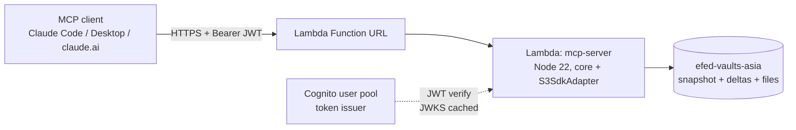

# Vault MCP Server — POC Design

Expose a synced vault as a remote **MCP server** reachable from the internet, so an assistant
(Claude Code/Desktop, Gemini CLI, and — once OAuth lands — the hosted chat surfaces) can search,
list, read, write, and delete notes and files. This document covers the POC: the smallest, cheapest
infrastructure that is still a **correct citizen of the sync protocol**. A search *index* remains
out of scope; budgeted index-free search shipped instead (§7).

Related: [IMPLEMENTATION.md](IMPLEMENTATION.md) (protocol §2, adapters §3),
[System Design.md](System%20Design.md) (why S3-as-hub).

---

## 1. The one load-bearing decision: MCP server = third protocol client

The vault's truth in S3 is **not** the `files/` prefix alone — it is the delta journal ⊕ snapshot
(IMPLEMENTATION.md §2). A naive Lambda that GETs/PUTs `files/<path>` directly would:

- **read** deleted files (tombstones live only in the journal; `files/` objects are never removed),
- **write** invisibly (no delta ⇒ neither leg ever pulls the change),
- **delete** destructively (removing the object while the journal still references it breaks the
  "journal never references a missing object" invariant).

So the MCP server is a **third client of the shared protocol**, exactly like git-sync and the
plugin, reusing `packages/core` unchanged:

| Concern | How |
|---|---|
| Read state | fold `snapshot.json.gz ⊕ listDeltasSince(snapshotRev)` — same as git-sync's `loadRemoteState` (§5.2 read side) |
| Write | PUT `files/<path>` **first**, then `appendDelta` (CAS `If-None-Match:*`, 412-retry loop) — files-before-delta ordering preserved |
| Delete | append a **tombstone** delta only; the `files/` object stays (matches both legs; S3 versioning keeps history) |
| Writer id | `by: "mcp"` — a constant; echo suppression on the other legs works unchanged (they only exclude their *own* id) |
| Conflicts | none to resolve server-side: MCP has no "local copy", every write is a fresh authoritative edit. Divergence with concurrent device edits is resolved *by the other legs'* three-way union merge against the versioned base, as designed |
| Storage adapter | `S3SdkAdapter` (AWS SDK v3) — same one git-sync uses |

Crucially, the server is **stateless**: unlike the plugin (cursor + per-file state) or git-sync
(`.sync/state.json`), it keeps *nothing* between requests. Every read re-folds live remote state
(one HEAD + one gzipped GET + one LIST + a few ~300 B delta GETs — snapshot compaction is ~daily,
so the fold is small); every write LISTs the journal head and CAS-appends at `head+1`. That is what
makes Lambda a perfect fit — no cursor to persist, no foreign-state anxiety, no resync concept.

> Warm-container optimization (optional, later): cache the parsed snapshot in module scope keyed by
> its ETag; a HEAD revalidates per request. Not needed for the POC.

### 1.1 Path policy

- **Reject unsafe paths** on every tool: `..` segments, absolute paths, backslashes, empty.
- **POC visibility scope: no dot-paths.** Any path with a segment starting with `.` (`.obsidian/`,
  `.sync/`, `.git*`, `.trash/`, `state.json.gz` lives under `.obsidian`) is hidden from `list`,
  unreadable, and unwritable. This sidesteps the whole exclusion matrix (§6) for the POC — the MCP
  surface is *content only*. `_logs/` is outside `files/` and never appears in the fold anyway.
- "Note" = path ending `.md` (the `type` scope in `list_notes`); everything else is a "file".

---

## 2. MCP surface

Transport: **Streamable HTTP, stateless mode** (`@modelcontextprotocol/sdk`,
`StreamableHTTPServerTransport` with `sessionIdGenerator: undefined`, `enableJsonResponse: true`).
Plain JSON request/response — no SSE stream needed — which is exactly what a Lambda can serve.
A new server+transport pair is constructed per invocation (the SDK's documented stateless pattern).

Tools:

| Tool | Input | Output | Notes |
|---|---|---|---|
| `search_notes` | `query`, `dir?`, `regex?`, `caseSensitive?`, `maxResults?`, `maxMatchesPerFile?`, `pathOnly?` | `{hits, scanned, candidates, truncated, reason?}` | index-free: one fold, then reads candidates newest-first under four budgets (§7) |
| `search` / `fetch` | `query` / `id` | ChatGPT connector shape | thin envelopes over `search_notes` / `get_note`, so OpenAI's clients can cite results |
| `list_notes` | `dir?` (prefix), `recursive?` (default true) | `[{path, size, mtime}]` | fold, filter `*.md`, drop tombstones + dot-paths |
| `list_files` | same | same, non-`.md` | same fold, one implementation |
| `get_note` | `path` | `{text, hash, size, mtime}` | 404 on tombstone/absent; `hash` returned to enable optimistic concurrency later |
| `save_note` | `path`, `text` | `{rev, hash}` | create or overwrite; `mtime = now`, `hash = contentHash`, PUT then `appendDelta` |
| `remove_note` | `path` | `{rev}` | tombstone delta |
| `get_file` | `path` | `{url, size, mtime}` — **presigned GET, 5 min** | avoids the 6 MB Lambda response cap; binary never transits Lambda |
| `save_file` | `path`, `base64` | `{rev, hash}` | cap ~4 MB (request limit is 6 MB); larger uploads are a post-POC problem (presigned-PUT two-step) |
| `remove_file` | `path` | `{rev}` | same as `remove_note` |

`remove_*` and `save_note` on a path of the wrong kind are just validation sugar — one code path
underneath. Errors surface as MCP tool errors with the reason (`not found`, `path excluded`,
`too large`, `CAS exhausted`).

> Presigned URL caveat: it exposes the raw S3 object for 5 minutes to whoever holds the URL. Same
> audience as the tool caller, acceptable for POC.

---

## 3. Infrastructure — smallest and cheapest



- **One Lambda function** (Node 22, arm64, 256–512 MB), bundled with esbuild like the plugin.
  Config via env: `BUCKET`, `PREFIX`, `AWS_REGION`, auth params. **One function per vault** —
  a second vault is a second function (or the same code with different env), zero shared state.
- **Lambda Function URL** as the endpoint. HTTPS, free, no per-request charge, no infra to manage.
  `AuthType: NONE` at the URL level; **auth is enforced in the handler** (§4).
- **No CloudFront** — it buys nothing for a low-traffic authenticated JSON API (no caching, no geo
  fan-out) and adds config + a second thing that can break. Add later only if a custom domain
  matters (or use a Route 53 → Function URL CNAME? Function URLs don't support custom domains
  directly — that, not performance, would be the actual reason to ever front it, and API Gateway
  HTTP API is the cheaper way to get it: ~$1/million requests).
- **No API Gateway (POC)** — its one genuine draw is the built-in JWT authorizer + custom domain;
  `aws-jwt-verify` in-handler is ~15 lines and keeps the bill at zero. Easy to slide in front later
  without touching the MCP code.
- **IAM**: a dedicated execution role, bucket-scoped policy identical in shape to the existing
  `vault-s3-sync` role's inline `s3` policy (get/put/list/delete on `arn:aws:s3:::<bucket>` +
  `/<prefix>*`), plus CloudWatch Logs.
- **No SQLite / no index / no EFS** — nothing in the POC needs storage beyond S3. The search index
  is exactly where that question returns, and it's deferred with it.

**Cost:** Lambda + Function URL sit inside the always-free tier at personal traffic volumes
(1 M requests + 400k GB-s / month); S3 request costs are noise on top of the existing sync traffic;
Cognito Essentials is free ≤ 10k MAU. **Effectively $0/month.**

---

## 4. Auth — Cognito, phased

Target end-state per the task: **AWS Cognito**. The MCP spec (2025-06-18) wants the server to act
as an **OAuth 2.1 resource server**: publish RFC 9728 protected-resource metadata pointing at the
issuer, return `401 + WWW-Authenticate` when unauthenticated, and let the client run the OAuth
flow. Claude's clients do this — but they also expect **Dynamic Client Registration (RFC 7591)**,
which Cognito does not offer. That gap defines the phasing:

**Phase 0 (POC bootstrap) — static bearer token.** A long random secret in the Lambda env
(or SSM parameter); handler compares `Authorization: Bearer <token>` (constant-time). Claude Code /
Claude Desktop attach it via the MCP `headers` config. One evening of work, proves the whole pipe.
Limitation: claude.ai web custom connectors can't send custom headers — they need real OAuth.

**Phase 1 — Cognito OAuth (the actual "auth by Cognito"):**
- Cognito **user pool** (one user: you) + **managed login / hosted UI** domain, one pre-registered
  **public client** (authorization-code + PKCE, no secret).
- Lambda validates the access-token JWT with **`aws-jwt-verify`** (issuer/audience/expiry; JWKS
  cached in the warm container).
- The same Lambda serves three tiny metadata routes alongside `/mcp`:
  - `GET /.well-known/oauth-protected-resource` — RFC 9728 doc pointing at the Cognito issuer;
  - `401` responses carry `WWW-Authenticate: Bearer resource_metadata="…"`;
  - `POST /register` — a **DCR shim**: ignores the request body and returns the pre-registered
    Cognito `client_id` (the standard workaround for Cognito's missing RFC 7591). Redirect-URI
    allowlist in Cognito must include the Claude clients' callback URLs.

Phase 0 and Phase 1 can coexist behind a flag; drop the static token once OAuth is verified from
every client that matters.

**Authorization** is all-or-nothing: any valid token = full read/write of the one vault. Scoping
(read-only tokens, per-directory grants) is post-POC.

---

## 5. Code layout & deploy

New workspace package, same shape as git-sync:

```
packages/mcp-server/
  src/handler.ts     # Lambda entry: routing (/mcp, /.well-known/*, /register), auth gate
  src/mcp.ts         # server + tool definitions (stateless per-invocation)
  src/vault.ts       # the protocol client: fold state, read, write+appendDelta, tombstone
  src/auth.ts        # bearer check (phase 0) / aws-jwt-verify (phase 1)
  test/              # vault.ts against core's in-memory StorageAdapter (no AWS, no Lambda)
```

- `core` stays pure; `vault.ts` composes `journal.ts`/`schemas.ts`/`hash.ts` with the **S3
  adapter imported from `packages/git-sync`** (workspace dep) — no new adapter, no core changes.
  If that import feels smelly later, promote the adapter to its own tiny package; not for the POC.
- **The exclusion-matrix lockstep rule (CLAUDE.md) is not triggered**: the MCP server never
  tombstones what it didn't touch — it has no "local side" to diff, so it can never fight the other
  legs over exclusions. The dot-path denylist (§1.1) is a *visibility* filter, not a sync rule.
- Testing follows the house pattern: the protocol client is exercised against
  `packages/core/src/memory.ts`, tool handlers unit-tested; no cloud in the loop.
- **Deploy (POC):** `scripts/install/05-create-mcp-server.sh` provisions and reconciles everything
  idempotently (role, function, URL, token) and doubles as the redeploy path;
  `npm run deploy -w @vault-sync/mcp-server` is the code-only fast path. Same script-bootstrap
  philosophy as the rest of `scripts/install`. A GitHub Actions deploy via the existing OIDC
  provider is a natural follow-up, not a POC requirement.

---

## 6. Consistency & failure notes

| Case | Behavior |
|---|---|
| Two MCP writes race, or MCP races git-sync/plugin | `appendDelta` CAS: loser 412s, re-lists, retries at `rev+1` — by design (§2.3) |
| MCP overwrites a note a device edited concurrently | Device's next pull sees remote change + local dirt → three-way union merge against versioned base. Nothing lost |
| Lambda dies between file PUT and delta append | Orphaned `files/` object version, journal untouched — same crash-safety story as the plugin (§9 "crash mid-push"); harmless, invisible |
| Read during another client's push | Fold is of *landed* deltas only — a consistent, possibly seconds-stale view. Fine for an agent |
| Lost-update on `save_note` (agent read v1, human made v2, agent writes over) | POC accepts LWW-from-MCP's-view; the *devices* still merge. Post-POC: optional `expectedHash` precondition on `save_note` (the hash is already returned by `get_note`) |

## 7. Out of scope (POC)

- **A search index** (SQLite, embeddings) — still deferred. Search *itself* shipped without one:
  `search_notes` folds state and reads candidate notes newest-first under explicit budgets (results,
  files, bytes, 20 s), returning `truncated` + `reason` when one bites, and a `search`/`fetch` pair
  in ChatGPT's connector shape sits on the same engine. That is affordable for a personal vault and
  keeps the server a clean stateless protocol client; an index is what a vault too large for the
  budgets would need, and it will likely hang off the same fold with an incremental cursor.
- Files > ~4 MB upload / presigned-PUT two-step; multi-vault routing in one function; scoped
  authorization; custom domain; rate limiting (Cognito + obscure URL suffices at POC risk level);
  MCP resources/prompts surface (tools only for now).